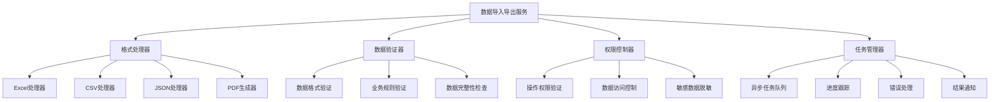

# 📊 数据导入导出功能设计文档

## 概述

本文档详细设计了数字钱包管理后台的数据导入导出功能，支持用户数据、交易记录、钱包信息、任务数据、红包记录、团队数据、排行榜数据等的批量导入导出，提供多种格式支持和安全保障机制。

## 功能架构

### 1. 整体架构设计



### 2. 支持的数据类型

#### 核心数据模块
```javascript
/**
 * 数据导入导出模块配置
 */
const DATA_MODULES = {
  // 用户数据
  users: {
    name: '用户数据',
    description: '用户基本信息、状态、统计数据',
    supportedFormats: ['excel', 'csv', 'json'],
    permissions: ['admin', 'user_manager'],
    sensitiveFields: ['phone', 'email', 'id_card'],
    maxRecords: 10000
  },
  
  // 钱包数据
  wallets: {
    name: '钱包数据',
    description: '钱包地址、余额、状态信息',
    supportedFormats: ['excel', 'csv', 'json'],
    permissions: ['admin', 'finance_manager'],
    sensitiveFields: ['private_key', 'mnemonic'],
    maxRecords: 50000
  },
  
  // 交易记录
  transactions: {
    name: '交易记录',
    description: '充值、提现、转账等交易数据',
    supportedFormats: ['excel', 'csv', 'json', 'pdf'],
    permissions: ['admin', 'finance_manager', 'auditor'],
    sensitiveFields: ['from_address', 'to_address'],
    maxRecords: 100000
  },
  
  // 任务数据
  tasks: {
    name: '任务数据',
    description: '用户任务完成情况和奖励记录',
    supportedFormats: ['excel', 'csv', 'json'],
    permissions: ['admin', 'operation_manager'],
    sensitiveFields: [],
    maxRecords: 200000
  },
  
  // 红包记录
  redPackets: {
    name: '红包记录',
    description: '红包发放、领取、使用记录',
    supportedFormats: ['excel', 'csv', 'json'],
    permissions: ['admin', 'operation_manager'],
    sensitiveFields: ['recipient_phone'],
    maxRecords: 500000
  },
  
  // 团队数据
  teams: {
    name: '团队数据',
    description: '团队结构、成员关系、业绩统计',
    supportedFormats: ['excel', 'csv', 'json'],
    permissions: ['admin', 'team_manager'],
    sensitiveFields: ['member_phone', 'member_email'],
    maxRecords: 20000
  },
  
  // 排行榜数据
  rankings: {
    name: '排行榜数据',
    description: '各类排行榜数据和历史记录',
    supportedFormats: ['excel', 'csv', 'json', 'pdf'],
    permissions: ['admin', 'operation_manager'],
    sensitiveFields: [],
    maxRecords: 10000
  },
  
  // 系统日志
  systemLogs: {
    name: '系统日志',
    description: '操作日志、错误日志、审计记录',
    supportedFormats: ['csv', 'json'],
    permissions: ['admin', 'system_manager'],
    sensitiveFields: ['ip_address', 'user_agent'],
    maxRecords: 1000000
  }
};
```

## 数据导出功能

### 1. 导出服务核心类

#### 数据导出管理器
```javascript
/**
 * 数据导出管理器
 */
const ExcelJS = require('exceljs');
const PDFDocument = require('pdfkit');
const fs = require('fs').promises;
const path = require('path');

class DataExportManager {
  constructor(db, taskQueue, permissionService) {
    this.db = db;
    this.taskQueue = taskQueue;
    this.permissionService = permissionService;
    this.exportPath = process.env.EXPORT_PATH || './exports';
    this.maxFileSize = 100 * 1024 * 1024; // 100MB
  }
  
  /**
   * 创建导出任务
   */
  async createExportTask(userId, moduleType, options = {}) {
    // 权限验证
    await this.permissionService.checkPermission(
      userId, 
      `export_${moduleType}`
    );
    
    const module = DATA_MODULES[moduleType];
    if (!module) {
      throw new Error(`不支持的数据模块: ${moduleType}`);
    }
    
    // 创建导出任务
    const taskId = `export_${moduleType}_${Date.now()}_${userId}`;
    const task = {
      id: taskId,
      userId,
      moduleType,
      moduleName: module.name,
      format: options.format || 'excel',
      filters: options.filters || {},
      columns: options.columns || [],
      status: 'pending',
      progress: 0,
      totalRecords: 0,
      processedRecords: 0,
      filePath: null,
      fileSize: 0,
      createdAt: new Date(),
      startedAt: null,
      completedAt: null,
      error: null
    };
    
    // 保存任务记录
    await this.saveExportTask(task);
    
    // 添加到异步队列
    await this.taskQueue.add('data-export', task, {
      attempts: 3,
      backoff: {
        type: 'exponential',
        delay: 2000
      }
    });
    
    return {
      taskId,
      message: '导出任务已创建，正在处理中...',
      estimatedTime: this.estimateExportTime(moduleType, options)
    };
  }
  
  /**
   * 执行数据导出
   */
  async executeExport(task) {
    try {
      await this.updateTaskStatus(task.id, 'processing', { startedAt: new Date() });
      
      // 获取数据
      const data = await this.fetchExportData(task);
      
      // 数据脱敏处理
      const sanitizedData = await this.sanitizeData(data, task.moduleType);
      
      // 生成文件
      const filePath = await this.generateExportFile(sanitizedData, task);
      
      // 更新任务状态
      await this.updateTaskStatus(task.id, 'completed', {
        filePath,
        fileSize: (await fs.stat(filePath)).size,
        completedAt: new Date(),
        totalRecords: data.length
      });
      
      // 发送完成通知
      await this.notifyExportComplete(task);
      
      return filePath;
    } catch (error) {
      await this.updateTaskStatus(task.id, 'failed', {
        error: error.message,
        completedAt: new Date()
      });
      
      throw error;
    }
  }
  
  /**
   * 获取导出数据
   */
  async fetchExportData(task) {
    const { moduleType, filters } = task;
    
    switch (moduleType) {
      case 'users':
        return await this.fetchUserData(filters);
      case 'wallets':
        return await this.fetchWalletData(filters);
      case 'transactions':
        return await this.fetchTransactionData(filters);
      case 'tasks':
        return await this.fetchTaskData(filters);
      case 'redPackets':
        return await this.fetchRedPacketData(filters);
      case 'teams':
        return await this.fetchTeamData(filters);
      case 'rankings':
        return await this.fetchRankingData(filters);
      case 'systemLogs':
        return await this.fetchSystemLogData(filters);
      default:
        throw new Error(`不支持的数据模块: ${moduleType}`);
    }
  }
  
  /**
   * 获取用户数据
   */
  async fetchUserData(filters) {
    let query = `
      SELECT 
        u.id,
        u.username,
        u.phone,
        u.email,
        u.status,
        u.level,
        u.created_at,
        u.last_login_at,
        w.balance,
        w.frozen_balance,
        (SELECT COUNT(*) FROM transactions t WHERE t.user_id = u.id) as transaction_count,
        (SELECT COUNT(*) FROM user_tasks ut WHERE ut.user_id = u.id AND ut.status = 'completed') as completed_tasks
      FROM users u
      LEFT JOIN wallets w ON u.id = w.user_id
      WHERE u.deleted_at IS NULL
    `;
    
    const conditions = [];
    const params = [];
    
    // 应用过滤条件
    if (filters.status) {
      conditions.push('u.status = ?');
      params.push(filters.status);
    }
    
    if (filters.level) {
      conditions.push('u.level = ?');
      params.push(filters.level);
    }
    
    if (filters.dateRange) {
      conditions.push('u.created_at BETWEEN ? AND ?');
      params.push(filters.dateRange.start, filters.dateRange.end);
    }
    
    if (filters.minBalance) {
      conditions.push('w.balance >= ?');
      params.push(filters.minBalance);
    }
    
    if (conditions.length > 0) {
      query += ' AND ' + conditions.join(' AND ');
    }
    
    query += ' ORDER BY u.created_at DESC';
    
    if (filters.limit) {
      query += ` LIMIT ${parseInt(filters.limit)}`;
    }
    
    return await this.db.query(query, params);
  }
  
  /**
   * 获取交易数据
   */
  async fetchTransactionData(filters) {
    let query = `
      SELECT 
        t.id,
        t.user_id,
        u.username,
        t.type,
        t.amount,
        t.fee,
        t.status,
        t.from_address,
        t.to_address,
        t.tx_hash,
        t.block_number,
        t.created_at,
        t.confirmed_at
      FROM transactions t
      LEFT JOIN users u ON t.user_id = u.id
      WHERE 1=1
    `;
    
    const conditions = [];
    const params = [];
    
    if (filters.type) {
      conditions.push('t.type = ?');
      params.push(filters.type);
    }
    
    if (filters.status) {
      conditions.push('t.status = ?');
      params.push(filters.status);
    }
    
    if (filters.dateRange) {
      conditions.push('t.created_at BETWEEN ? AND ?');
      params.push(filters.dateRange.start, filters.dateRange.end);
    }
    
    if (filters.minAmount) {
      conditions.push('t.amount >= ?');
      params.push(filters.minAmount);
    }
    
    if (filters.userId) {
      conditions.push('t.user_id = ?');
      params.push(filters.userId);
    }
    
    if (conditions.length > 0) {
      query += ' AND ' + conditions.join(' AND ');
    }
    
    query += ' ORDER BY t.created_at DESC';
    
    if (filters.limit) {
      query += ` LIMIT ${parseInt(filters.limit)}`;
    }
    
    return await this.db.query(query, params);
  }
  
  /**
   * 数据脱敏处理
   */
  async sanitizeData(data, moduleType) {
    const module = DATA_MODULES[moduleType];
    if (!module.sensitiveFields || module.sensitiveFields.length === 0) {
      return data;
    }
    
    return data.map(record => {
      const sanitized = { ...record };
      
      module.sensitiveFields.forEach(field => {
        if (sanitized[field]) {
          sanitized[field] = this.maskSensitiveData(sanitized[field], field);
        }
      });
      
      return sanitized;
    });
  }
  
  /**
   * 敏感数据掩码
   */
  maskSensitiveData(value, fieldType) {
    if (!value) return value;
    
    switch (fieldType) {
      case 'phone':
        return value.replace(/(\d{3})\d{4}(\d{4})/, '$1****$2');
      case 'email':
        return value.replace(/(.{2}).*(@.*)/, '$1****$2');
      case 'id_card':
        return value.replace(/(\d{6})\d{8}(\d{4})/, '$1********$2');
      case 'from_address':
      case 'to_address':
        return value.replace(/(.{6}).*(.{6})/, '$1****$2');
      case 'private_key':
      case 'mnemonic':
        return '***已隐藏***';
      default:
        return value.replace(/(.{2}).*(.{2})/, '$1****$2');
    }
  }
  
  /**
   * 生成导出文件
   */
  async generateExportFile(data, task) {
    const { format, moduleType } = task;
    const timestamp = new Date().toISOString().replace(/[:.]/g, '-');
    const filename = `${moduleType}_export_${timestamp}.${format}`;
    const filePath = path.join(this.exportPath, filename);
    
    // 确保导出目录存在
    await fs.mkdir(this.exportPath, { recursive: true });
    
    switch (format) {
      case 'excel':
        return await this.generateExcelFile(data, filePath, task);
      case 'csv':
        return await this.generateCSVFile(data, filePath, task);
      case 'json':
        return await this.generateJSONFile(data, filePath, task);
      case 'pdf':
        return await this.generatePDFFile(data, filePath, task);
      default:
        throw new Error(`不支持的导出格式: ${format}`);
    }
  }
  
  /**
   * 生成Excel文件
   */
  async generateExcelFile(data, filePath, task) {
    const workbook = new ExcelJS.Workbook();
    const worksheet = workbook.addWorksheet(task.moduleName);
    
    if (data.length === 0) {
      worksheet.addRow(['无数据']);
      await workbook.xlsx.writeFile(filePath);
      return filePath;
    }
    
    // 设置列标题
    const columns = Object.keys(data[0]).map(key => ({
      header: this.getColumnDisplayName(key, task.moduleType),
      key: key,
      width: this.getColumnWidth(key)
    }));
    
    worksheet.columns = columns;
    
    // 设置标题样式
    worksheet.getRow(1).font = { bold: true };
    worksheet.getRow(1).fill = {
      type: 'pattern',
      pattern: 'solid',
      fgColor: { argb: 'FFE0E0E0' }
    };
    
    // 添加数据行
    data.forEach((record, index) => {
      const row = worksheet.addRow(record);
      
      // 设置数据格式
      Object.keys(record).forEach((key, colIndex) => {
        const cell = row.getCell(colIndex + 1);
        
        if (key.includes('amount') || key.includes('balance')) {
          cell.numFmt = '#,##0.00';
        } else if (key.includes('_at') && record[key]) {
          cell.value = new Date(record[key]);
          cell.numFmt = 'yyyy-mm-dd hh:mm:ss';
        }
      });
      
      // 更新进度
      if (index % 1000 === 0) {
        const progress = Math.floor((index / data.length) * 100);
        this.updateTaskProgress(task.id, progress);
      }
    });
    
    // 自动调整列宽
    worksheet.columns.forEach(column => {
      if (!column.width) {
        column.width = 15;
      }
    });
    
    await workbook.xlsx.writeFile(filePath);
    return filePath;
  }
  
  /**
   * 生成CSV文件
   */
  async generateCSVFile(data, filePath, task) {
    const createCsvWriter = require('csv-writer').createObjectCsvWriter;
    
    if (data.length === 0) {
      await fs.writeFile(filePath, '无数据\n', 'utf8');
      return filePath;
    }
    
    const headers = Object.keys(data[0]).map(key => ({
      id: key,
      title: this.getColumnDisplayName(key, task.moduleType)
    }));
    
    const csvWriter = createCsvWriter({
      path: filePath,
      header: headers,
      encoding: 'utf8'
    });
    
    // 分批写入数据，避免内存溢出
    const batchSize = 5000;
    for (let i = 0; i < data.length; i += batchSize) {
      const batch = data.slice(i, i + batchSize);
      
      if (i === 0) {
        await csvWriter.writeRecords(batch);
      } else {
        // 追加模式写入
        const csvWriterAppend = createCsvWriter({
          path: filePath,
          header: headers,
          append: true
        });
        await csvWriterAppend.writeRecords(batch);
      }
      
      // 更新进度
      const progress = Math.floor(((i + batch.length) / data.length) * 100);
      await this.updateTaskProgress(task.id, progress);
    }
    
    return filePath;
  }
  
  /**
   * 生成JSON文件
   */
  async generateJSONFile(data, filePath, task) {
    const exportData = {
      module: task.moduleName,
      exportTime: new Date().toISOString(),
      totalRecords: data.length,
      data: data
    };
    
    await fs.writeFile(filePath, JSON.stringify(exportData, null, 2), 'utf8');
    return filePath;
  }
  
  /**
   * 生成PDF报表
   */
  async generatePDFFile(data, filePath, task) {
    const doc = new PDFDocument({ margin: 50 });
    const stream = fs.createWriteStream(filePath);
    doc.pipe(stream);
    
    // 添加标题
    doc.fontSize(20).text(task.moduleName + ' 导出报表', { align: 'center' });
    doc.moveDown();
    
    // 添加导出信息
    doc.fontSize(12)
       .text(`导出时间: ${new Date().toLocaleString()}`)
       .text(`记录总数: ${data.length}`)
       .moveDown();
    
    if (data.length === 0) {
      doc.text('无数据');
    } else {
      // 根据数据类型生成不同的报表格式
      switch (task.moduleType) {
        case 'transactions':
          await this.generateTransactionPDFReport(doc, data);
          break;
        case 'rankings':
          await this.generateRankingPDFReport(doc, data);
          break;
        default:
          await this.generateGenericPDFReport(doc, data);
      }
    }
    
    doc.end();
    
    return new Promise((resolve, reject) => {
      stream.on('finish', () => resolve(filePath));
      stream.on('error', reject);
    });
  }
  
  /**
   * 获取列显示名称
   */
  getColumnDisplayName(key, moduleType) {
    const columnNames = {
      // 通用字段
      id: 'ID',
      created_at: '创建时间',
      updated_at: '更新时间',
      status: '状态',
      
      // 用户相关
      user_id: '用户ID',
      username: '用户名',
      phone: '手机号',
      email: '邮箱',
      level: '等级',
      last_login_at: '最后登录',
      
      // 钱包相关
      address: '钱包地址',
      balance: '余额',
      frozen_balance: '冻结余额',
      
      // 交易相关
      type: '交易类型',
      amount: '金额',
      fee: '手续费',
      from_address: '发送地址',
      to_address: '接收地址',
      tx_hash: '交易哈希',
      block_number: '区块号',
      confirmed_at: '确认时间',
      
      // 任务相关
      task_name: '任务名称',
      reward_amount: '奖励金额',
      completed_at: '完成时间',
      
      // 红包相关
      packet_amount: '红包金额',
      packet_count: '红包数量',
      received_count: '已领取数量',
      
      // 团队相关
      team_name: '团队名称',
      member_count: '成员数量',
      total_performance: '总业绩'
    };
    
    return columnNames[key] || key;
  }
  
  /**
   * 获取列宽度
   */
  getColumnWidth(key) {
    const widthMap = {
      id: 10,
      username: 15,
      phone: 15,
      email: 20,
      address: 25,
      tx_hash: 25,
      created_at: 20,
      updated_at: 20,
      amount: 15,
      balance: 15
    };
    
    return widthMap[key] || 12;
  }
  
  /**
   * 更新任务状态
   */
  async updateTaskStatus(taskId, status, updates = {}) {
    const updateData = {
      status,
      ...updates
    };
    
    await this.db.query(
      'UPDATE export_tasks SET ? WHERE id = ?',
      [updateData, taskId]
    );
  }
  
  /**
   * 更新任务进度
   */
  async updateTaskProgress(taskId, progress) {
    await this.db.query(
      'UPDATE export_tasks SET progress = ? WHERE id = ?',
      [progress, taskId]
    );
  }
  
  /**
   * 保存导出任务
   */
  async saveExportTask(task) {
    await this.db.query(`
      INSERT INTO export_tasks (
        id, user_id, module_type, module_name, format, filters,
        status, progress, created_at
      ) VALUES (?, ?, ?, ?, ?, ?, ?, ?, ?)
    `, [
      task.id, task.userId, task.moduleType, task.moduleName,
      task.format, JSON.stringify(task.filters), task.status,
      task.progress, task.createdAt
    ]);
  }
}
```

## 数据导入功能

### 1. 数据导入管理器

#### 导入服务核心类
```javascript
/**
 * 数据导入管理器
 */
class DataImportManager {
  constructor(db, taskQueue, permissionService) {
    this.db = db;
    this.taskQueue = taskQueue;
    this.permissionService = permissionService;
    this.uploadPath = process.env.UPLOAD_PATH || './uploads';
    this.maxFileSize = 50 * 1024 * 1024; // 50MB
  }
  
  /**
   * 创建导入任务
   */
  async createImportTask(userId, moduleType, file, options = {}) {
    // 权限验证
    await this.permissionService.checkPermission(
      userId, 
      `import_${moduleType}`
    );
    
    const module = DATA_MODULES[moduleType];
    if (!module) {
      throw new Error(`不支持的数据模块: ${moduleType}`);
    }
    
    // 文件验证
    await this.validateImportFile(file, module);
    
    // 保存上传文件
    const filePath = await this.saveUploadFile(file);
    
    // 创建导入任务
    const taskId = `import_${moduleType}_${Date.now()}_${userId}`;
    const task = {
      id: taskId,
      userId,
      moduleType,
      moduleName: module.name,
      filePath,
      fileName: file.originalname,
      fileSize: file.size,
      options: options,
      status: 'pending',
      progress: 0,
      totalRecords: 0,
      processedRecords: 0,
      successRecords: 0,
      failedRecords: 0,
      validationErrors: [],
      createdAt: new Date(),
      startedAt: null,
      completedAt: null,
      error: null
    };
    
    // 保存任务记录
    await this.saveImportTask(task);
    
    // 添加到异步队列
    await this.taskQueue.add('data-import', task, {
      attempts: 3,
      backoff: {
        type: 'exponential',
        delay: 2000
      }
    });
    
    return {
      taskId,
      message: '导入任务已创建，正在处理中...',
      estimatedTime: this.estimateImportTime(file.size)
    };
  }
  
  /**
   * 执行数据导入
   */
  async executeImport(task) {
    try {
      await this.updateTaskStatus(task.id, 'processing', { startedAt: new Date() });
      
      // 解析文件数据
      const rawData = await this.parseImportFile(task);
      
      // 数据验证
      const validationResult = await this.validateImportData(rawData, task);
      
      if (validationResult.errors.length > 0) {
        await this.updateTaskStatus(task.id, 'validation_failed', {
          validationErrors: validationResult.errors,
          completedAt: new Date()
        });
        return;
      }
      
      // 数据导入
      const importResult = await this.importValidatedData(
        validationResult.validData, 
        task
      );
      
      // 更新任务状态
      await this.updateTaskStatus(task.id, 'completed', {
        totalRecords: rawData.length,
        processedRecords: importResult.processed,
        successRecords: importResult.success,
        failedRecords: importResult.failed,
        completedAt: new Date()
      });
      
      // 发送完成通知
      await this.notifyImportComplete(task, importResult);
      
    } catch (error) {
      await this.updateTaskStatus(task.id, 'failed', {
        error: error.message,
        completedAt: new Date()
      });
      
      throw error;
    }
  }
  
  /**
   * 解析导入文件
   */
  async parseImportFile(task) {
    const { filePath, fileName } = task;
    const fileExtension = path.extname(fileName).toLowerCase();
    
    switch (fileExtension) {
      case '.xlsx':
      case '.xls':
        return await this.parseExcelFile(filePath);
      case '.csv':
        return await this.parseCSVFile(filePath);
      case '.json':
        return await this.parseJSONFile(filePath);
      default:
        throw new Error(`不支持的文件格式: ${fileExtension}`);
    }
  }
  
  /**
   * 解析Excel文件
   */
  async parseExcelFile(filePath) {
    const workbook = new ExcelJS.Workbook();
    await workbook.xlsx.readFile(filePath);
    
    const worksheet = workbook.getWorksheet(1);
    const data = [];
    
    // 获取标题行
    const headerRow = worksheet.getRow(1);
    const headers = [];
    
    headerRow.eachCell((cell, colNumber) => {
      headers[colNumber] = cell.value;
    });
    
    // 读取数据行
    worksheet.eachRow((row, rowNumber) => {
      if (rowNumber === 1) return; // 跳过标题行
      
      const record = {};
      row.eachCell((cell, colNumber) => {
        const header = headers[colNumber];
        if (header) {
          record[header] = cell.value;
        }
      });
      
      data.push(record);
    });
    
    return data;
  }
  
  /**
   * 解析CSV文件
   */
  async parseCSVFile(filePath) {
    const csv = require('csv-parser');
    const fs = require('fs');
    
    return new Promise((resolve, reject) => {
      const results = [];
      
      fs.createReadStream(filePath)
        .pipe(csv())
        .on('data', (data) => results.push(data))
        .on('end', () => resolve(results))
        .on('error', reject);
    });
  }
  
  /**
   * 解析JSON文件
   */
  async parseJSONFile(filePath) {
    const content = await fs.readFile(filePath, 'utf8');
    const jsonData = JSON.parse(content);
    
    // 支持两种格式：直接数组或包含data字段的对象
    return Array.isArray(jsonData) ? jsonData : jsonData.data || [];
  }
  
  /**
   * 验证导入数据
   */
  async validateImportData(data, task) {
    const { moduleType } = task;
    const errors = [];
    const validData = [];
    
    for (let i = 0; i < data.length; i++) {
      const record = data[i];
      const rowNumber = i + 2; // Excel行号（包含标题行）
      
      try {
        const validatedRecord = await this.validateRecord(record, moduleType, rowNumber);
        validData.push(validatedRecord);
      } catch (error) {
        errors.push({
          row: rowNumber,
          error: error.message,
          data: record
        });
      }
      
      // 更新进度
      if (i % 100 === 0) {
        const progress = Math.floor((i / data.length) * 50); // 验证占50%进度
        await this.updateTaskProgress(task.id, progress);
      }
    }
    
    return { validData, errors };
  }
  
  /**
   * 验证单条记录
   */
  async validateRecord(record, moduleType, rowNumber) {
    switch (moduleType) {
      case 'users':
        return await this.validateUserRecord(record, rowNumber);
      case 'wallets':
        return await this.validateWalletRecord(record, rowNumber);
      case 'transactions':
        return await this.validateTransactionRecord(record, rowNumber);
      default:
        return record;
    }
  }
  
  /**
   * 验证用户记录
   */
  async validateUserRecord(record, rowNumber) {
    const errors = [];
    
    // 必填字段验证
    if (!record.username) {
      errors.push('用户名不能为空');
    }
    
    if (!record.phone) {
      errors.push('手机号不能为空');
    } else if (!/^1[3-9]\d{9}$/.test(record.phone)) {
      errors.push('手机号格式不正确');
    }
    
    if (record.email && !/^[^\s@]+@[^\s@]+\.[^\s@]+$/.test(record.email)) {
      errors.push('邮箱格式不正确');
    }
    
    // 唯一性验证
    if (record.username) {
      const existingUser = await this.db.query(
        'SELECT id FROM users WHERE username = ? AND deleted_at IS NULL',
        [record.username]
      );
      
      if (existingUser.length > 0) {
        errors.push('用户名已存在');
      }
    }
    
    if (record.phone) {
      const existingPhone = await this.db.query(
        'SELECT id FROM users WHERE phone = ? AND deleted_at IS NULL',
        [record.phone]
      );
      
      if (existingPhone.length > 0) {
        errors.push('手机号已存在');
      }
    }
    
    if (errors.length > 0) {
      throw new Error(`第${rowNumber}行: ${errors.join(', ')}`);
    }
    
    return {
      username: record.username,
      phone: record.phone,
      email: record.email || null,
      status: record.status || 'active',
      level: parseInt(record.level) || 1,
      created_at: new Date()
    };
  }
  
  /**
   * 导入验证后的数据
   */
  async importValidatedData(data, task) {
    const { moduleType } = task;
    let processed = 0;
    let success = 0;
    let failed = 0;
    
    // 开启事务
    await this.db.beginTransaction();
    
    try {
      for (const record of data) {
        try {
          await this.importSingleRecord(record, moduleType);
          success++;
        } catch (error) {
          console.error(`导入记录失败:`, error);
          failed++;
        }
        
        processed++;
        
        // 更新进度
        if (processed % 100 === 0) {
          const progress = 50 + Math.floor((processed / data.length) * 50);
          await this.updateTaskProgress(task.id, progress);
        }
      }
      
      await this.db.commit();
      
    } catch (error) {
      await this.db.rollback();
      throw error;
    }
    
    return { processed, success, failed };
  }
  
  /**
   * 导入单条记录
   */
  async importSingleRecord(record, moduleType) {
    switch (moduleType) {
      case 'users':
        return await this.importUserRecord(record);
      case 'wallets':
        return await this.importWalletRecord(record);
      case 'transactions':
        return await this.importTransactionRecord(record);
      default:
        throw new Error(`不支持的导入模块: ${moduleType}`);
    }
  }
  
  /**
   * 导入用户记录
   */
  async importUserRecord(record) {
    const result = await this.db.query(`
      INSERT INTO users (username, phone, email, status, level, created_at)
      VALUES (?, ?, ?, ?, ?, ?)
    `, [
      record.username,
      record.phone,
      record.email,
      record.status,
      record.level,
      record.created_at
    ]);
    
    // 创建对应的钱包
    if (result.insertId) {
      await this.createUserWallet(result.insertId);
    }
    
    return result.insertId;
  }
  
  /**
   * 文件验证
   */
  async validateImportFile(file, module) {
    // 文件大小验证
    if (file.size > this.maxFileSize) {
      throw new Error(`文件大小超过限制 (${this.maxFileSize / 1024 / 1024}MB)`);
    }
    
    // 文件格式验证
    const allowedExtensions = ['.xlsx', '.xls', '.csv', '.json'];
    const fileExtension = path.extname(file.originalname).toLowerCase();
    
    if (!allowedExtensions.includes(fileExtension)) {
      throw new Error(`不支持的文件格式: ${fileExtension}`);
    }
    
    // 文件内容验证（检查是否为空文件）
    if (file.size === 0) {
      throw new Error('文件内容为空');
    }
  }
  
  /**
   * 保存上传文件
   */
  async saveUploadFile(file) {
    const timestamp = Date.now();
    const filename = `${timestamp}_${file.originalname}`;
    const filePath = path.join(this.uploadPath, filename);
    
    // 确保上传目录存在
    await fs.mkdir(this.uploadPath, { recursive: true });
    
    // 保存文件
    await fs.writeFile(filePath, file.buffer);
    
    return filePath;
  }
}
```

## API接口设计

### 1. 导出接口

#### 导出相关API
```javascript
/**
 * 数据导出API路由
 */
const express = require('express');
const router = express.Router();
const multer = require('multer');
const { body, query, validationResult } = require('express-validator');

// 中间件
const authMiddleware = require('../middleware/auth');
const permissionMiddleware = require('../middleware/permission');
const rateLimitMiddleware = require('../middleware/rateLimit');

// 服务
const dataExportManager = new DataExportManager(db, taskQueue, permissionService);
const dataImportManager = new DataImportManager(db, taskQueue, permissionService);

/**
 * 创建导出任务
 * POST /api/admin/export/create
 */
router.post('/create',
  authMiddleware,
  rateLimitMiddleware({ windowMs: 60000, max: 10 }), // 1分钟10次
  [
    body('moduleType').isIn(Object.keys(DATA_MODULES)).withMessage('无效的数据模块'),
    body('format').isIn(['excel', 'csv', 'json', 'pdf']).withMessage('无效的导出格式'),
    body('filters').optional().isObject().withMessage('过滤条件必须是对象'),
    body('columns').optional().isArray().withMessage('列配置必须是数组')
  ],
  async (req, res) => {
    try {
      const errors = validationResult(req);
      if (!errors.isEmpty()) {
        return res.status(400).json({
          success: false,
          message: '参数验证失败',
          errors: errors.array()
        });
      }
      
      const { moduleType, format, filters, columns } = req.body;
      const userId = req.user.id;
      
      const result = await dataExportManager.createExportTask(userId, moduleType, {
        format,
        filters,
        columns
      });
      
      res.json({
        success: true,
        data: result
      });
      
    } catch (error) {
      console.error('创建导出任务失败:', error);
      res.status(500).json({
        success: false,
        message: error.message
      });
    }
  }
);

/**
 * 获取导出任务列表
 * GET /api/admin/export/tasks
 */
router.get('/tasks',
  authMiddleware,
  [
    query('page').optional().isInt({ min: 1 }).withMessage('页码必须是正整数'),
    query('limit').optional().isInt({ min: 1, max: 100 }).withMessage('每页数量必须在1-100之间'),
    query('status').optional().isIn(['pending', 'processing', 'completed', 'failed']).withMessage('无效的状态')
  ],
  async (req, res) => {
    try {
      const errors = validationResult(req);
      if (!errors.isEmpty()) {
        return res.status(400).json({
          success: false,
          message: '参数验证失败',
          errors: errors.array()
        });
      }
      
      const page = parseInt(req.query.page) || 1;
      const limit = parseInt(req.query.limit) || 20;
      const status = req.query.status;
      const userId = req.user.id;
      
      // 构建查询条件
      let whereClause = 'WHERE user_id = ?';
      const params = [userId];
      
      if (status) {
        whereClause += ' AND status = ?';
        params.push(status);
      }
      
      // 获取总数
      const [countResult] = await db.query(
        `SELECT COUNT(*) as total FROM export_tasks ${whereClause}`,
        params
      );
      
      // 获取任务列表
      const tasks = await db.query(`
        SELECT 
          id, module_type, module_name, format, status, progress,
          total_records, file_size, created_at, completed_at, error
        FROM export_tasks 
        ${whereClause}
        ORDER BY created_at DESC
        LIMIT ? OFFSET ?
      `, [...params, limit, (page - 1) * limit]);
      
      res.json({
        success: true,
        data: {
          tasks,
          pagination: {
            page,
            limit,
            total: countResult.total,
            pages: Math.ceil(countResult.total / limit)
          }
        }
      });
      
    } catch (error) {
      console.error('获取导出任务列表失败:', error);
      res.status(500).json({
        success: false,
        message: '获取任务列表失败'
      });
    }
  }
);

/**
 * 下载导出文件
 * GET /api/admin/export/download/:taskId
 */
router.get('/download/:taskId',
  authMiddleware,
  async (req, res) => {
    try {
      const { taskId } = req.params;
      const userId = req.user.id;
      
      // 获取任务信息
      const [task] = await db.query(`
        SELECT file_path, file_name, status, user_id
        FROM export_tasks 
        WHERE id = ?
      `, [taskId]);
      
      if (!task) {
        return res.status(404).json({
          success: false,
          message: '导出任务不存在'
        });
      }
      
      // 权限验证
      if (task.user_id !== userId && !req.user.permissions.includes('admin')) {
        return res.status(403).json({
          success: false,
          message: '无权限下载此文件'
        });
      }
      
      if (task.status !== 'completed') {
        return res.status(400).json({
          success: false,
          message: '文件尚未生成完成'
        });
      }
      
      // 检查文件是否存在
      if (!await fs.access(task.file_path).then(() => true).catch(() => false)) {
        return res.status(404).json({
          success: false,
          message: '文件不存在或已过期'
        });
      }
      
      // 设置下载头
      res.setHeader('Content-Disposition', `attachment; filename="${task.file_name}"`);
      res.setHeader('Content-Type', 'application/octet-stream');
      
      // 发送文件
      res.sendFile(path.resolve(task.file_path));
      
    } catch (error) {
      console.error('下载导出文件失败:', error);
      res.status(500).json({
        success: false,
        message: '下载文件失败'
      });
    }
  }
);
```

### 2. 导入接口

#### 导入相关API
```javascript
/**
 * 文件上传配置
 */
const upload = multer({
  storage: multer.memoryStorage(),
  limits: {
    fileSize: 50 * 1024 * 1024 // 50MB
  },
  fileFilter: (req, file, cb) => {
    const allowedTypes = [
      'application/vnd.openxmlformats-officedocument.spreadsheetml.sheet',
      'application/vnd.ms-excel',
      'text/csv',
      'application/json'
    ];
    
    if (allowedTypes.includes(file.mimetype)) {
      cb(null, true);
    } else {
      cb(new Error('不支持的文件类型'), false);
    }
  }
});

/**
 * 创建导入任务
 * POST /api/admin/import/create
 */
router.post('/create',
  authMiddleware,
  upload.single('file'),
  rateLimitMiddleware({ windowMs: 60000, max: 5 }), // 1分钟5次
  [
    body('moduleType').isIn(Object.keys(DATA_MODULES)).withMessage('无效的数据模块'),
    body('options').optional().isObject().withMessage('选项必须是对象')
  ],
  async (req, res) => {
    try {
      const errors = validationResult(req);
      if (!errors.isEmpty()) {
        return res.status(400).json({
          success: false,
          message: '参数验证失败',
          errors: errors.array()
        });
      }
      
      if (!req.file) {
        return res.status(400).json({
          success: false,
          message: '请选择要导入的文件'
        });
      }
      
      const { moduleType, options } = req.body;
      const userId = req.user.id;
      
      const result = await dataImportManager.createImportTask(
        userId, 
        moduleType, 
        req.file, 
        JSON.parse(options || '{}')
      );
      
      res.json({
        success: true,
        data: result
      });
      
    } catch (error) {
      console.error('创建导入任务失败:', error);
      res.status(500).json({
        success: false,
        message: error.message
      });
    }
  }
);

/**
 * 获取导入任务详情
 * GET /api/admin/import/task/:taskId
 */
router.get('/task/:taskId',
  authMiddleware,
  async (req, res) => {
    try {
      const { taskId } = req.params;
      const userId = req.user.id;
      
      const [task] = await db.query(`
        SELECT 
          id, module_type, module_name, file_name, file_size,
          status, progress, total_records, processed_records,
          success_records, failed_records, validation_errors,
          created_at, started_at, completed_at, error
        FROM import_tasks 
        WHERE id = ? AND user_id = ?
      `, [taskId, userId]);
      
      if (!task) {
        return res.status(404).json({
          success: false,
          message: '导入任务不存在'
        });
      }
      
      // 解析验证错误
      if (task.validation_errors) {
        task.validation_errors = JSON.parse(task.validation_errors);
      }
      
      res.json({
        success: true,
        data: task
      });
      
    } catch (error) {
      console.error('获取导入任务详情失败:', error);
      res.status(500).json({
        success: false,
        message: '获取任务详情失败'
      });
    }
  }
);

/**
 * 获取数据模板
 * GET /api/admin/import/template/:moduleType
 */
router.get('/template/:moduleType',
  authMiddleware,
  async (req, res) => {
    try {
      const { moduleType } = req.params;
      
      if (!DATA_MODULES[moduleType]) {
        return res.status(400).json({
          success: false,
          message: '无效的数据模块'
        });
      }
      
      const template = await generateImportTemplate(moduleType);
      
      res.setHeader('Content-Disposition', `attachment; filename="${moduleType}_template.xlsx"`);
      res.setHeader('Content-Type', 'application/vnd.openxmlformats-officedocument.spreadsheetml.sheet');
      
      await template.xlsx.write(res);
      res.end();
      
    } catch (error) {
      console.error('生成导入模板失败:', error);
      res.status(500).json({
        success: false,
        message: '生成模板失败'
      });
    }
  }
);

/**
 * 生成导入模板
 */
async function generateImportTemplate(moduleType) {
  const workbook = new ExcelJS.Workbook();
  const worksheet = workbook.addWorksheet('导入模板');
  
  // 根据模块类型设置列
  let columns = [];
  
  switch (moduleType) {
    case 'users':
      columns = [
        { header: '用户名*', key: 'username', width: 15 },
        { header: '手机号*', key: 'phone', width: 15 },
        { header: '邮箱', key: 'email', width: 20 },
        { header: '状态', key: 'status', width: 10 },
        { header: '等级', key: 'level', width: 10 }
      ];
      break;
    case 'transactions':
      columns = [
        { header: '用户ID*', key: 'user_id', width: 10 },
        { header: '交易类型*', key: 'type', width: 15 },
        { header: '金额*', key: 'amount', width: 15 },
        { header: '手续费', key: 'fee', width: 10 },
        { header: '状态*', key: 'status', width: 10 }
      ];
      break;
    default:
      columns = [
        { header: '示例列1', key: 'column1', width: 15 },
        { header: '示例列2', key: 'column2', width: 15 }
      ];
  }
  
  worksheet.columns = columns;
  
  // 设置标题样式
  worksheet.getRow(1).font = { bold: true };
  worksheet.getRow(1).fill = {
    type: 'pattern',
    pattern: 'solid',
    fgColor: { argb: 'FFE0E0E0' }
  };
  
  // 添加说明行
  worksheet.addRow([]);
  worksheet.addRow(['说明：']);
  worksheet.addRow(['1. 带*号的列为必填项']);
  worksheet.addRow(['2. 请严格按照模板格式填写数据']);
  worksheet.addRow(['3. 导入前请删除此说明部分']);
  
  return workbook;
}

module.exports = router;
```

## 数据库设计

### 1. 导入导出任务表

#### 表结构设计
```sql
-- 导出任务表
CREATE TABLE export_tasks (
  id VARCHAR(100) PRIMARY KEY COMMENT '任务ID',
  user_id INT NOT NULL COMMENT '用户ID',
  module_type VARCHAR(50) NOT NULL COMMENT '数据模块类型',
  module_name VARCHAR(100) NOT NULL COMMENT '数据模块名称',
  format VARCHAR(20) NOT NULL COMMENT '导出格式',
  filters JSON COMMENT '过滤条件',
  columns JSON COMMENT '导出列配置',
  status ENUM('pending', 'processing', 'completed', 'failed') DEFAULT 'pending' COMMENT '任务状态',
  progress INT DEFAULT 0 COMMENT '进度百分比',
  total_records INT DEFAULT 0 COMMENT '总记录数',
  processed_records INT DEFAULT 0 COMMENT '已处理记录数',
  file_path VARCHAR(500) COMMENT '文件路径',
  file_size BIGINT DEFAULT 0 COMMENT '文件大小',
  created_at TIMESTAMP DEFAULT CURRENT_TIMESTAMP COMMENT '创建时间',
  started_at TIMESTAMP NULL COMMENT '开始时间',
  completed_at TIMESTAMP NULL COMMENT '完成时间',
  error TEXT COMMENT '错误信息',
  INDEX idx_user_id (user_id),
  INDEX idx_status (status),
  INDEX idx_created_at (created_at)
) ENGINE=InnoDB DEFAULT CHARSET=utf8mb4 COMMENT='数据导出任务表';

-- 导入任务表
CREATE TABLE import_tasks (
  id VARCHAR(100) PRIMARY KEY COMMENT '任务ID',
  user_id INT NOT NULL COMMENT '用户ID',
  module_type VARCHAR(50) NOT NULL COMMENT '数据模块类型',
  module_name VARCHAR(100) NOT NULL COMMENT '数据模块名称',
  file_path VARCHAR(500) NOT NULL COMMENT '文件路径',
  file_name VARCHAR(200) NOT NULL COMMENT '文件名',
  file_size BIGINT NOT NULL COMMENT '文件大小',
  options JSON COMMENT '导入选项',
  status ENUM('pending', 'processing', 'validation_failed', 'completed', 'failed') DEFAULT 'pending' COMMENT '任务状态',
  progress INT DEFAULT 0 COMMENT '进度百分比',
  total_records INT DEFAULT 0 COMMENT '总记录数',
  processed_records INT DEFAULT 0 COMMENT '已处理记录数',
  success_records INT DEFAULT 0 COMMENT '成功记录数',
  failed_records INT DEFAULT 0 COMMENT '失败记录数',
  validation_errors JSON COMMENT '验证错误',
  created_at TIMESTAMP DEFAULT CURRENT_TIMESTAMP COMMENT '创建时间',
  started_at TIMESTAMP NULL COMMENT '开始时间',
  completed_at TIMESTAMP NULL COMMENT '完成时间',
  error TEXT COMMENT '错误信息',
  INDEX idx_user_id (user_id),
  INDEX idx_status (status),
  INDEX idx_created_at (created_at)
) ENGINE=InnoDB DEFAULT CHARSET=utf8mb4 COMMENT='数据导入任务表';

-- 导入导出操作日志表
CREATE TABLE import_export_logs (
  id BIGINT AUTO_INCREMENT PRIMARY KEY,
  task_id VARCHAR(100) NOT NULL COMMENT '任务ID',
  task_type ENUM('import', 'export') NOT NULL COMMENT '任务类型',
  user_id INT NOT NULL COMMENT '操作用户ID',
  operation VARCHAR(50) NOT NULL COMMENT '操作类型',
  details JSON COMMENT '操作详情',
  ip_address VARCHAR(45) COMMENT 'IP地址',
  user_agent TEXT COMMENT '用户代理',
  created_at TIMESTAMP DEFAULT CURRENT_TIMESTAMP COMMENT '创建时间',
  INDEX idx_task_id (task_id),
  INDEX idx_user_id (user_id),
  INDEX idx_created_at (created_at)
) ENGINE=InnoDB DEFAULT CHARSET=utf8mb4 COMMENT='导入导出操作日志表';
```

## 前端界面设计

### 1. 数据导出界面

#### React导出组件
```jsx
/**
 * 数据导出组件
 */
import React, { useState, useEffect } from 'react';
import { 
  Card, 
  Form, 
  Select, 
  Button, 
  DatePicker, 
  InputNumber, 
  Checkbox, 
  Table, 
  Progress, 
  message, 
  Modal 
} from 'antd';
import { DownloadOutlined, ExportOutlined } from '@ant-design/icons';

const { RangePicker } = DatePicker;
const { Option } = Select;

const DataExportPage = () => {
  const [form] = Form.useForm();
  const [loading, setLoading] = useState(false);
  const [exportTasks, setExportTasks] = useState([]);
  const [selectedModule, setSelectedModule] = useState('');
  
  // 数据模块配置
  const dataModules = {
    users: { name: '用户数据', icon: '👥' },
    wallets: { name: '钱包数据', icon: '💰' },
    transactions: { name: '交易记录', icon: '💳' },
    tasks: { name: '任务数据', icon: '📋' },
    redPackets: { name: '红包记录', icon: '🧧' },
    teams: { name: '团队数据', icon: '👨‍👩‍👧‍👦' },
    rankings: { name: '排行榜数据', icon: '🏆' },
    systemLogs: { name: '系统日志', icon: '📝' }
  };
  
  // 导出格式选项
  const formatOptions = [
    { value: 'excel', label: 'Excel (.xlsx)', icon: '📊' },
    { value: 'csv', label: 'CSV (.csv)', icon: '📄' },
    { value: 'json', label: 'JSON (.json)', icon: '🔧' },
    { value: 'pdf', label: 'PDF (.pdf)', icon: '📑' }
  ];
  
  useEffect(() => {
    loadExportTasks();
    
    // 定时刷新任务状态
    const interval = setInterval(loadExportTasks, 5000);
    return () => clearInterval(interval);
  }, []);
  
  /**
   * 加载导出任务列表
   */
  const loadExportTasks = async () => {
    try {
      const response = await fetch('/api/admin/export/tasks');
      const result = await response.json();
      
      if (result.success) {
        setExportTasks(result.data.tasks);
      }
    } catch (error) {
      console.error('加载导出任务失败:', error);
    }
  };
  
  /**
   * 创建导出任务
   */
  const handleExport = async (values) => {
    setLoading(true);
    
    try {
      const response = await fetch('/api/admin/export/create', {
        method: 'POST',
        headers: {
          'Content-Type': 'application/json'
        },
        body: JSON.stringify(values)
      });
      
      const result = await response.json();
      
      if (result.success) {
        message.success('导出任务已创建，正在处理中...');
        form.resetFields();
        loadExportTasks();
      } else {
        message.error(result.message || '创建导出任务失败');
      }
    } catch (error) {
      console.error('创建导出任务失败:', error);
      message.error('创建导出任务失败');
    } finally {
      setLoading(false);
    }
  };
  
  /**
   * 下载导出文件
   */
  const handleDownload = async (taskId) => {
    try {
      const response = await fetch(`/api/admin/export/download/${taskId}`);
      
      if (response.ok) {
        const blob = await response.blob();
        const url = window.URL.createObjectURL(blob);
        const a = document.createElement('a');
        a.href = url;
        a.download = response.headers.get('Content-Disposition')?.split('filename=')[1] || 'export.xlsx';
        document.body.appendChild(a);
        a.click();
        document.body.removeChild(a);
        window.URL.revokeObjectURL(url);
      } else {
        const result = await response.json();
        message.error(result.message || '下载失败');
      }
    } catch (error) {
      console.error('下载文件失败:', error);
      message.error('下载文件失败');
    }
  };
  
  /**
   * 渲染过滤条件表单
   */
  const renderFilterForm = () => {
    if (!selectedModule) return null;
    
    switch (selectedModule) {
      case 'users':
        return (
          <>
            <Form.Item name={['filters', 'status']} label="用户状态">
              <Select placeholder="选择用户状态" allowClear>
                <Option value="active">活跃</Option>
                <Option value="inactive">非活跃</Option>
                <Option value="suspended">已暂停</Option>
              </Select>
            </Form.Item>
            <Form.Item name={['filters', 'level']} label="用户等级">
              <InputNumber placeholder="用户等级" min={1} max={10} />
            </Form.Item>
            <Form.Item name={['filters', 'dateRange']} label="注册时间">
              <RangePicker showTime />
            </Form.Item>
            <Form.Item name={['filters', 'minBalance']} label="最小余额">
              <InputNumber placeholder="最小余额" min={0} precision={2} />
            </Form.Item>
          </>
        );
      case 'transactions':
        return (
          <>
            <Form.Item name={['filters', 'type']} label="交易类型">
              <Select placeholder="选择交易类型" allowClear>
                <Option value="deposit">充值</Option>
                <Option value="withdraw">提现</Option>
                <Option value="transfer">转账</Option>
                <Option value="reward">奖励</Option>
              </Select>
            </Form.Item>
            <Form.Item name={['filters', 'status']} label="交易状态">
              <Select placeholder="选择交易状态" allowClear>
                <Option value="pending">待处理</Option>
                <Option value="confirmed">已确认</Option>
                <Option value="failed">失败</Option>
              </Select>
            </Form.Item>
            <Form.Item name={['filters', 'dateRange']} label="交易时间">
              <RangePicker showTime />
            </Form.Item>
            <Form.Item name={['filters', 'minAmount']} label="最小金额">
              <InputNumber placeholder="最小金额" min={0} precision={2} />
            </Form.Item>
          </>
        );
      default:
        return (
          <Form.Item name={['filters', 'dateRange']} label="时间范围">
            <RangePicker showTime />
          </Form.Item>
        );
    }
  };
  
  // 任务状态列配置
  const taskColumns = [
    {
      title: '模块',
      dataIndex: 'module_name',
      key: 'module_name',
      render: (text, record) => (
        <span>
          {dataModules[record.module_type]?.icon} {text}
        </span>
      )
    },
    {
      title: '格式',
      dataIndex: 'format',
      key: 'format',
      render: (format) => {
        const option = formatOptions.find(opt => opt.value === format);
        return option ? `${option.icon} ${option.label}` : format;
      }
    },
    {
      title: '状态',
      dataIndex: 'status',
      key: 'status',
      render: (status) => {
        const statusMap = {
          pending: { color: '#faad14', text: '等待中' },
          processing: { color: '#1890ff', text: '处理中' },
          completed: { color: '#52c41a', text: '已完成' },
          failed: { color: '#ff4d4f', text: '失败' }
        };
        
        const statusInfo = statusMap[status] || { color: '#d9d9d9', text: status };
        
        return (
          <span style={{ color: statusInfo.color }}>
            ● {statusInfo.text}
          </span>
        );
      }
    },
    {
      title: '进度',
      dataIndex: 'progress',
      key: 'progress',
      render: (progress, record) => (
        record.status === 'processing' ? (
          <Progress percent={progress} size="small" />
        ) : (
          record.status === 'completed' ? '100%' : '-'
        )
      )
    },
    {
      title: '记录数',
      dataIndex: 'total_records',
      key: 'total_records',
      render: (count) => count ? count.toLocaleString() : '-'
    },
    {
      title: '文件大小',
      dataIndex: 'file_size',
      key: 'file_size',
      render: (size) => {
        if (!size) return '-';
        if (size < 1024) return `${size} B`;
        if (size < 1024 * 1024) return `${(size / 1024).toFixed(1)} KB`;
        return `${(size / 1024 / 1024).toFixed(1)} MB`;
      }
    },
    {
      title: '创建时间',
      dataIndex: 'created_at',
      key: 'created_at',
      render: (time) => new Date(time).toLocaleString()
    },
    {
      title: '操作',
      key: 'action',
      render: (_, record) => (
        record.status === 'completed' ? (
          <Button
            type="link"
            icon={<DownloadOutlined />}
            onClick={() => handleDownload(record.id)}
          >
            下载
          </Button>
        ) : record.status === 'failed' ? (
          <span style={{ color: '#ff4d4f' }}>{record.error}</span>
        ) : null
      )
    }
  ];
  
  return (
    <div className="data-export-page">
      <Card title="📤 数据导出" style={{ marginBottom: 24 }}>
        <Form
          form={form}
          layout="vertical"
          onFinish={handleExport}
        >
          <div style={{ display: 'grid', gridTemplateColumns: 'repeat(auto-fit, minmax(300px, 1fr))', gap: 16 }}>
            <Form.Item
              name="moduleType"
              label="数据模块"
              rules={[{ required: true, message: '请选择数据模块' }]}
            >
              <Select
                placeholder="选择要导出的数据模块"
                onChange={setSelectedModule}
              >
                {Object.entries(dataModules).map(([key, module]) => (
                  <Option key={key} value={key}>
                    {module.icon} {module.name}
                  </Option>
                ))}
              </Select>
            </Form.Item>
            
            <Form.Item
              name="format"
              label="导出格式"
              rules={[{ required: true, message: '请选择导出格式' }]}
            >
              <Select placeholder="选择导出格式">
                {formatOptions.map(option => (
                  <Option key={option.value} value={option.value}>
                    {option.icon} {option.label}
                  </Option>
                ))}
              </Select>
            </Form.Item>
          </div>
          
          {renderFilterForm()}
          
          <Form.Item name={['filters', 'limit']} label="导出数量限制">
            <InputNumber
              placeholder="最大导出记录数（留空表示全部）"
              min={1}
              max={1000000}
              style={{ width: '100%' }}
            />
          </Form.Item>
          
          <Form.Item>
            <Button
              type="primary"
              htmlType="submit"
              icon={<ExportOutlined />}
              loading={loading}
              size="large"
            >
              创建导出任务
            </Button>
          </Form.Item>
        </Form>
      </Card>
      
      <Card title="📋 导出任务列表">
        <Table
          columns={taskColumns}
          dataSource={exportTasks}
          rowKey="id"
          pagination={{
            pageSize: 10,
            showSizeChanger: true,
            showQuickJumper: true,
            showTotal: (total) => `共 ${total} 条记录`
          }}
        />
      </Card>
    </div>
  );
};

export default DataExportPage;
```

### 2. 数据导入界面

#### React导入组件
```jsx
/**
 * 数据导入组件
 */
import React, { useState, useEffect } from 'react';
import { 
  Card, 
  Upload, 
  Button, 
  Select, 
  Table, 
  Progress, 
  message, 
  Modal, 
  Alert,
  Steps,
  Descriptions
} from 'antd';
import { 
  InboxOutlined, 
  UploadOutlined, 
  DownloadOutlined,
  CheckCircleOutlined,
  ExclamationCircleOutlined
} from '@ant-design/icons';

const { Dragger } = Upload;
const { Option } = Select;
const { Step } = Steps;

const DataImportPage = () => {
  const [selectedModule, setSelectedModule] = useState('');
  const [uploadFile, setUploadFile] = useState(null);
  const [importing, setImporting] = useState(false);
  const [importTasks, setImportTasks] = useState([]);
  const [taskDetailModal, setTaskDetailModal] = useState({ visible: false, task: null });
  
  // 数据模块配置
  const dataModules = {
    users: { 
      name: '用户数据', 
      icon: '👥',
      description: '批量导入用户基本信息',
      maxRecords: 10000,
      requiredFields: ['username', 'phone']
    },
    wallets: { 
      name: '钱包数据', 
      icon: '💰',
      description: '批量导入钱包信息',
      maxRecords: 50000,
      requiredFields: ['user_id', 'address']
    },
    transactions: { 
      name: '交易记录', 
      icon: '💳',
      description: '批量导入交易数据',
      maxRecords: 100000,
      requiredFields: ['user_id', 'type', 'amount']
    }
  };
  
  useEffect(() => {
    loadImportTasks();
    
    // 定时刷新任务状态
    const interval = setInterval(loadImportTasks, 5000);
    return () => clearInterval(interval);
  }, []);
  
  /**
   * 加载导入任务列表
   */
  const loadImportTasks = async () => {
    try {
      const response = await fetch('/api/admin/import/tasks');
      const result = await response.json();
      
      if (result.success) {
        setImportTasks(result.data.tasks);
      }
    } catch (error) {
      console.error('加载导入任务失败:', error);
    }
  };
  
  /**
   * 下载导入模板
   */
  const handleDownloadTemplate = async () => {
    if (!selectedModule) {
      message.warning('请先选择数据模块');
      return;
    }
    
    try {
      const response = await fetch(`/api/admin/import/template/${selectedModule}`);
      
      if (response.ok) {
        const blob = await response.blob();
        const url = window.URL.createObjectURL(blob);
        const a = document.createElement('a');
        a.href = url;
        a.download = `${selectedModule}_template.xlsx`;
        document.body.appendChild(a);
        a.click();
        document.body.removeChild(a);
        window.URL.revokeObjectURL(url);
        
        message.success('模板下载成功');
      } else {
        message.error('下载模板失败');
      }
    } catch (error) {
      console.error('下载模板失败:', error);
      message.error('下载模板失败');
    }
  };
  
  /**
   * 文件上传配置
   */
  const uploadProps = {
    name: 'file',
    multiple: false,
    accept: '.xlsx,.xls,.csv,.json',
    beforeUpload: (file) => {
      // 文件大小验证
      const isLt50M = file.size / 1024 / 1024 < 50;
      if (!isLt50M) {
        message.error('文件大小不能超过 50MB');
        return false;
      }
      
      // 文件格式验证
      const allowedTypes = [
        'application/vnd.openxmlformats-officedocument.spreadsheetml.sheet',
        'application/vnd.ms-excel',
        'text/csv',
        'application/json'
      ];
      
      if (!allowedTypes.includes(file.type)) {
        message.error('只支持 Excel、CSV、JSON 格式文件');
        return false;
      }
      
      setUploadFile(file);
      return false; // 阻止自动上传
    },
    onRemove: () => {
      setUploadFile(null);
    }
  };
  
  /**
   * 执行导入
   */
  const handleImport = async () => {
    if (!selectedModule) {
      message.warning('请选择数据模块');
      return;
    }
    
    if (!uploadFile) {
      message.warning('请选择要导入的文件');
      return;
    }
    
    setImporting(true);
    
    try {
      const formData = new FormData();
      formData.append('file', uploadFile);
      formData.append('moduleType', selectedModule);
      formData.append('options', JSON.stringify({}));
      
      const response = await fetch('/api/admin/import/create', {
        method: 'POST',
        body: formData
      });
      
      const result = await response.json();
      
      if (result.success) {
        message.success('导入任务已创建，正在处理中...');
        setUploadFile(null);
        setSelectedModule('');
        loadImportTasks();
      } else {
        message.error(result.message || '创建导入任务失败');
      }
    } catch (error) {
      console.error('创建导入任务失败:', error);
      message.error('创建导入任务失败');
    } finally {
      setImporting(false);
    }
  };
  
  /**
   * 查看任务详情
   */
  const handleViewTaskDetail = async (taskId) => {
    try {
      const response = await fetch(`/api/admin/import/task/${taskId}`);
      const result = await response.json();
      
      if (result.success) {
        setTaskDetailModal({ visible: true, task: result.data });
      } else {
        message.error('获取任务详情失败');
      }
    } catch (error) {
      console.error('获取任务详情失败:', error);
      message.error('获取任务详情失败');
    }
  };
  
  // 任务状态列配置
  const taskColumns = [
    {
      title: '模块',
      dataIndex: 'module_name',
      key: 'module_name',
      render: (text, record) => (
        <span>
          {dataModules[record.module_type]?.icon} {text}
        </span>
      )
    },
    {
      title: '文件名',
      dataIndex: 'file_name',
      key: 'file_name'
    },
    {
      title: '状态',
      dataIndex: 'status',
      key: 'status',
      render: (status) => {
        const statusMap = {
          pending: { color: '#faad14', text: '等待中', icon: '⏳' },
          processing: { color: '#1890ff', text: '处理中', icon: '🔄' },
          validation_failed: { color: '#ff7a45', text: '验证失败', icon: '⚠️' },
          completed: { color: '#52c41a', text: '已完成', icon: '✅' },
          failed: { color: '#ff4d4f', text: '失败', icon: '❌' }
        };
        
        const statusInfo = statusMap[status] || { color: '#d9d9d9', text: status, icon: '❓' };
        
        return (
          <span style={{ color: statusInfo.color }}>
            {statusInfo.icon} {statusInfo.text}
          </span>
        );
      }
    },
    {
      title: '进度',
      dataIndex: 'progress',
      key: 'progress',
      render: (progress, record) => (
        record.status === 'processing' ? (
          <Progress percent={progress} size="small" />
        ) : (
          record.status === 'completed' ? '100%' : '-'
        )
      )
    },
    {
      title: '记录统计',
      key: 'records',
      render: (_, record) => (
        record.total_records > 0 ? (
          <div>
            <div>总数: {record.total_records.toLocaleString()}</div>
            <div style={{ color: '#52c41a' }}>成功: {record.success_records.toLocaleString()}</div>
            {record.failed_records > 0 && (
              <div style={{ color: '#ff4d4f' }}>失败: {record.failed_records.toLocaleString()}</div>
            )}
          </div>
        ) : '-'
      )
    },
    {
      title: '创建时间',
      dataIndex: 'created_at',
      key: 'created_at',
      render: (time) => new Date(time).toLocaleString()
    },
    {
      title: '操作',
      key: 'action',
      render: (_, record) => (
        <Button
          type="link"
          onClick={() => handleViewTaskDetail(record.id)}
        >
          查看详情
        </Button>
      )
    }
  ];
  
  return (
    <div className="data-import-page">
      <Card title="📥 数据导入" style={{ marginBottom: 24 }}>
        <Steps current={uploadFile ? (selectedModule ? 2 : 1) : 0} style={{ marginBottom: 24 }}>
          <Step title="选择模块" description="选择要导入的数据模块" />
          <Step title="上传文件" description="上传符合格式的数据文件" />
          <Step title="开始导入" description="执行数据导入操作" />
        </Steps>
        
        <div style={{ display: 'grid', gridTemplateColumns: 'repeat(auto-fit, minmax(300px, 1fr))', gap: 24 }}>
          <div>
            <h4>1. 选择数据模块</h4>
            <Select
              placeholder="选择要导入的数据模块"
              style={{ width: '100%', marginBottom: 16 }}
              value={selectedModule}
              onChange={setSelectedModule}
            >
              {Object.entries(dataModules).map(([key, module]) => (
                <Option key={key} value={key}>
                  {module.icon} {module.name}
                </Option>
              ))}
            </Select>
            
            {selectedModule && (
              <Alert
                message={dataModules[selectedModule].description}
                description={
                  <div>
                    <p>最大记录数: {dataModules[selectedModule].maxRecords.toLocaleString()}</p>
                    <p>必填字段: {dataModules[selectedModule].requiredFields.join(', ')}</p>
                  </div>
                }
                type="info"
                showIcon
                style={{ marginBottom: 16 }}
              />
            )}
            
            <Button
              icon={<DownloadOutlined />}
              onClick={handleDownloadTemplate}
              disabled={!selectedModule}
              block
            >
              下载导入模板
            </Button>
          </div>
          
          <div>
            <h4>2. 上传数据文件</h4>
            <Dragger {...uploadProps} style={{ marginBottom: 16 }}>
              <p className="ant-upload-drag-icon">
                <InboxOutlined />
              </p>
              <p className="ant-upload-text">点击或拖拽文件到此区域上传</p>
              <p className="ant-upload-hint">
                支持 Excel (.xlsx, .xls)、CSV (.csv)、JSON (.json) 格式
                <br />
                文件大小不超过 50MB
              </p>
            </Dragger>
            
            <Button
              type="primary"
              icon={<UploadOutlined />}
              onClick={handleImport}
              disabled={!selectedModule || !uploadFile}
              loading={importing}
              block
              size="large"
            >
              开始导入
            </Button>
          </div>
        </div>
      </Card>
      
      <Card title="📋 导入任务列表">
        <Table
          columns={taskColumns}
          dataSource={importTasks}
          rowKey="id"
          pagination={{
            pageSize: 10,
            showSizeChanger: true,
            showQuickJumper: true,
            showTotal: (total) => `共 ${total} 条记录`
          }}
        />
      </Card>
      
      {/* 任务详情弹窗 */}
      <Modal
        title="导入任务详情"
        visible={taskDetailModal.visible}
        onCancel={() => setTaskDetailModal({ visible: false, task: null })}
        footer={null}
        width={800}
      >
        {taskDetailModal.task && (
          <div>
            <Descriptions column={2} bordered>
              <Descriptions.Item label="任务ID">{taskDetailModal.task.id}</Descriptions.Item>
              <Descriptions.Item label="数据模块">{taskDetailModal.task.module_name}</Descriptions.Item>
              <Descriptions.Item label="文件名">{taskDetailModal.task.file_name}</Descriptions.Item>
              <Descriptions.Item label="文件大小">
                {(taskDetailModal.task.file_size / 1024 / 1024).toFixed(2)} MB
              </Descriptions.Item>
              <Descriptions.Item label="状态">{taskDetailModal.task.status}</Descriptions.Item>
              <Descriptions.Item label="进度">{taskDetailModal.task.progress}%</Descriptions.Item>
              <Descriptions.Item label="总记录数">{taskDetailModal.task.total_records}</Descriptions.Item>
              <Descriptions.Item label="成功记录数">{taskDetailModal.task.success_records}</Descriptions.Item>
              <Descriptions.Item label="失败记录数">{taskDetailModal.task.failed_records}</Descriptions.Item>
              <Descriptions.Item label="创建时间">
                {new Date(taskDetailModal.task.created_at).toLocaleString()}
              </Descriptions.Item>
            </Descriptions>
            
            {taskDetailModal.task.validation_errors && taskDetailModal.task.validation_errors.length > 0 && (
              <div style={{ marginTop: 16 }}>
                <h4>验证错误</h4>
                <div style={{ maxHeight: 300, overflow: 'auto' }}>
                  {taskDetailModal.task.validation_errors.map((error, index) => (
                    <Alert
                      key={index}
                      message={`第 ${error.row} 行: ${error.error}`}
                      type="error"
                      showIcon
                      style={{ marginBottom: 8 }}
                    />
                  ))}
                </div>
              </div>
            )}
            
            {taskDetailModal.task.error && (
              <div style={{ marginTop: 16 }}>
                <Alert
                  message="执行错误"
                  description={taskDetailModal.task.error}
                  type="error"
                  showIcon
                />
              </div>
            )}
          </div>
        )}
      </Modal>
    </div>
  );
};

export default DataImportPage;
```

## 安全和性能优化

### 1. 安全措施

#### 安全配置
```javascript
/**
 * 数据导入导出安全配置
 */
const SECURITY_CONFIG = {
  // 文件上传安全
  upload: {
    maxFileSize: 50 * 1024 * 1024, // 50MB
    allowedMimeTypes: [
      'application/vnd.openxmlformats-officedocument.spreadsheetml.sheet',
      'application/vnd.ms-excel',
      'text/csv',
      'application/json'
    ],
    scanForVirus: true,
    quarantinePath: './quarantine'
  },
  
  // 数据脱敏规则
  dataMasking: {
    phone: /(\d{3})\d{4}(\d{4})/,
    email: /(.{2}).*(@.*)/,
    idCard: /(\d{6})\d{8}(\d{4})/,
    address: /(.{6}).*(.{6})/
  },
  
  // 访问控制
  accessControl: {
    maxConcurrentTasks: 3,
    dailyExportLimit: 10,
    dailyImportLimit: 5,
    ipWhitelist: process.env.ADMIN_IP_WHITELIST?.split(',') || []
  },
  
  // 审计日志
  auditLog: {
    enabled: true,
    logLevel: 'info',
    retentionDays: 90,
    sensitiveFields: ['password', 'private_key', 'mnemonic']
  }
};
```

### 2. 性能优化

#### 性能优化策略
```javascript
/**
 * 性能优化配置
 */
const PERFORMANCE_CONFIG = {
  // 批处理配置
  batchProcessing: {
    batchSize: 1000,
    maxConcurrency: 5,
    memoryThreshold: 500 * 1024 * 1024 // 500MB
  },
  
  // 缓存配置
  cache: {
    enabled: true,
    ttl: 3600, // 1小时
    maxSize: 1000,
    keyPrefix: 'import_export:'
  },
  
  // 队列配置
  queue: {
    concurrency: 3,
    maxRetries: 3,
    backoffDelay: 2000,
    removeOnComplete: 10,
    removeOnFail: 50
  }
};
```

## 部署和运维

### 1. Docker配置

#### Dockerfile
```dockerfile
# 数据导入导出服务 Dockerfile
FROM node:16-alpine

WORKDIR /app

# 安装系统依赖
RUN apk add --no-cache \
    python3 \
    make \
    g++ \
    cairo-dev \
    jpeg-dev \
    pango-dev \
    giflib-dev

# 复制依赖文件
COPY package*.json ./
RUN npm ci --only=production

# 复制应用代码
COPY . .

# 创建必要目录
RUN mkdir -p uploads exports logs

# 设置权限
RUN chown -R node:node /app
USER node

# 健康检查
HEALTHCHECK --interval=30s --timeout=3s --start-period=5s --retries=3 \
  CMD curl -f http://localhost:3000/health || exit 1

EXPOSE 3000

CMD ["npm", "start"]
```

### 2. 监控和告警

#### 监控指标
```javascript
/**
 * 导入导出监控指标
 */
const MONITORING_METRICS = {
  // 任务指标
  tasks: {
    totalTasks: 'import_export_tasks_total',
    activeTasks: 'import_export_tasks_active',
    completedTasks: 'import_export_tasks_completed',
    failedTasks: 'import_export_tasks_failed',
    averageProcessingTime: 'import_export_processing_time_avg'
  },
  
  // 性能指标
  performance: {
    memoryUsage: 'import_export_memory_usage',
    cpuUsage: 'import_export_cpu_usage',
    diskUsage: 'import_export_disk_usage',
    queueLength: 'import_export_queue_length'
  },
  
  // 业务指标
  business: {
    recordsProcessed: 'import_export_records_processed_total',
    filesProcessed: 'import_export_files_processed_total',
    errorRate: 'import_export_error_rate',
    throughput: 'import_export_throughput'
  }
};
```

## 总结

本数据导入导出功能设计文档提供了完整的解决方案，包括：

### 核心特性
- **多格式支持**: Excel、CSV、JSON、PDF
- **8大数据模块**: 用户、钱包、交易、任务、红包、团队、排行榜、系统日志
- **异步处理**: 大文件异步处理，实时进度跟踪
- **数据验证**: 完整的数据格式和业务规则验证
- **安全保障**: 数据脱敏、权限控制、审计日志
- **性能优化**: 批处理、缓存、队列管理

### 技术亮点
- **模块化设计**: 易于扩展和维护
- **错误处理**: 完善的错误处理和恢复机制
- **监控告警**: 全面的性能和业务监控
- **用户体验**: 直观的界面和操作流程

### 安全合规
- **数据保护**: 敏感数据自动脱敏
- **访问控制**: 基于角色的权限管理
- **审计追踪**: 完整的操作日志记录
- **文件安全**: 文件类型验证和病毒扫描

该设计方案能够满足数字钱包管理后台的数据导入导出需求，提供高效、安全、易用的数据处理能力。