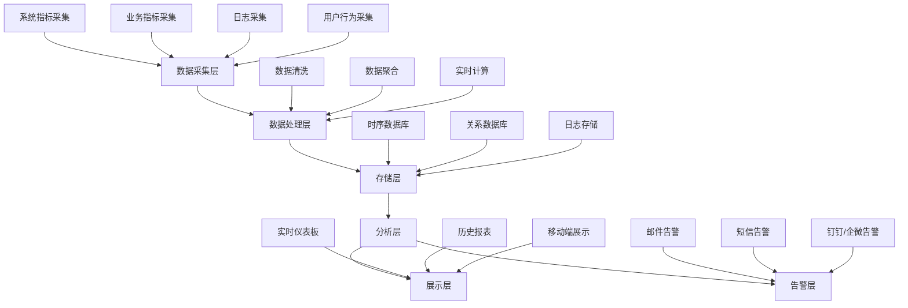

# 🔍 实时监控系统设计文档

## 概述

本文档详细设计了数字钱包管理后台的实时监控系统，包括系统性能监控、业务指标监控、告警通知机制、日志管理和可视化展示，确保系统稳定运行和及时发现问题。

## 监控系统架构

### 1. 整体架构设计



### 2. 技术栈选择

#### 监控组件
```javascript
/**
 * 监控系统技术栈配置
 */
const MONITORING_STACK = {
  // 数据采集
  dataCollection: {
    systemMetrics: 'node-exporter',      // 系统指标采集
    applicationMetrics: 'prom-client',   // 应用指标采集
    logCollection: 'winston',            // 日志采集
    tracing: 'jaeger',                   // 链路追踪
  },
  
  // 数据存储
  storage: {
    timeSeries: 'InfluxDB',              // 时序数据库
    logs: 'Elasticsearch',               // 日志存储
    cache: 'Redis',                      // 缓存存储
    relational: 'MySQL'                  // 关系数据库
  },
  
  // 数据处理
  processing: {
    realTime: 'Node.js Streams',         // 实时处理
    batch: 'Node.js Cron Jobs',          // 批处理
    aggregation: 'InfluxDB Functions'    // 数据聚合
  },
  
  // 可视化展示
  visualization: {
    dashboard: 'Grafana',                // 仪表板
    webUI: 'React + Chart.js',          // Web界面
    mobile: 'React Native'               // 移动端
  },
  
  // 告警通知
  alerting: {
    engine: 'Grafana Alerting',         // 告警引擎
    notification: 'Custom Webhook',      // 通知服务
    escalation: 'PagerDuty'             // 告警升级
  }
};
```

## 数据采集系统

### 1. 系统指标采集

#### 服务器性能监控
```javascript
/**
 * 系统性能指标采集器
 */
const os = require('os');
const fs = require('fs').promises;
const { InfluxDB, Point } = require('@influxdata/influxdb-client');

class SystemMetricsCollector {
  constructor() {
    this.influxDB = new InfluxDB({
      url: process.env.INFLUXDB_URL,
      token: process.env.INFLUXDB_TOKEN
    });
    this.writeApi = this.influxDB.getWriteApi(
      process.env.INFLUXDB_ORG,
      process.env.INFLUXDB_BUCKET
    );
  }
  
  /**
   * 收集CPU指标
   */
  async collectCPUMetrics() {
    const cpus = os.cpus();
    const loadAvg = os.loadavg();
    
    // CPU使用率
    let totalIdle = 0;
    let totalTick = 0;
    
    cpus.forEach(cpu => {
      for (const type in cpu.times) {
        totalTick += cpu.times[type];
      }
      totalIdle += cpu.times.idle;
    });
    
    const cpuUsage = 100 - (totalIdle / totalTick * 100);
    
    // 写入InfluxDB
    const point = new Point('system_cpu')
      .floatField('usage_percent', cpuUsage)
      .floatField('load_1m', loadAvg[0])
      .floatField('load_5m', loadAvg[1])
      .floatField('load_15m', loadAvg[2])
      .intField('core_count', cpus.length)
      .tag('host', os.hostname())
      .timestamp(new Date());
    
    this.writeApi.writePoint(point);
    
    return {
      usage: cpuUsage,
      loadAverage: loadAvg,
      coreCount: cpus.length
    };
  }
  
  /**
   * 收集内存指标
   */
  async collectMemoryMetrics() {
    const totalMem = os.totalmem();
    const freeMem = os.freemem();
    const usedMem = totalMem - freeMem;
    const memUsage = (usedMem / totalMem) * 100;
    
    // 获取进程内存使用情况
    const processMemory = process.memoryUsage();
    
    const point = new Point('system_memory')
      .intField('total_bytes', totalMem)
      .intField('used_bytes', usedMem)
      .intField('free_bytes', freeMem)
      .floatField('usage_percent', memUsage)
      .intField('process_rss', processMemory.rss)
      .intField('process_heap_used', processMemory.heapUsed)
      .intField('process_heap_total', processMemory.heapTotal)
      .tag('host', os.hostname())
      .timestamp(new Date());
    
    this.writeApi.writePoint(point);
    
    return {
      total: totalMem,
      used: usedMem,
      free: freeMem,
      usage: memUsage,
      process: processMemory
    };
  }
  
  /**
   * 收集磁盘指标
   */
  async collectDiskMetrics() {
    try {
      const stats = await fs.stat('/');
      // 注意：这里需要使用系统命令获取更准确的磁盘使用情况
      const { exec } = require('child_process');
      const { promisify } = require('util');
      const execAsync = promisify(exec);
      
      const { stdout } = await execAsync('df -h / | tail -1');
      const diskInfo = stdout.trim().split(/\s+/);
      
      const point = new Point('system_disk')
        .stringField('filesystem', diskInfo[0])
        .stringField('size', diskInfo[1])
        .stringField('used', diskInfo[2])
        .stringField('available', diskInfo[3])
        .stringField('usage_percent', diskInfo[4])
        .tag('host', os.hostname())
        .timestamp(new Date());
      
      this.writeApi.writePoint(point);
      
      return {
        filesystem: diskInfo[0],
        size: diskInfo[1],
        used: diskInfo[2],
        available: diskInfo[3],
        usage: diskInfo[4]
      };
    } catch (error) {
      console.error('磁盘指标收集失败:', error);
      return null;
    }
  }
  
  /**
   * 收集网络指标
   */
  async collectNetworkMetrics() {
    const networkInterfaces = os.networkInterfaces();
    const metrics = [];
    
    for (const [name, interfaces] of Object.entries(networkInterfaces)) {
      for (const iface of interfaces) {
        if (!iface.internal && iface.family === 'IPv4') {
          const point = new Point('system_network')
            .stringField('interface', name)
            .stringField('address', iface.address)
            .stringField('netmask', iface.netmask)
            .stringField('mac', iface.mac)
            .tag('host', os.hostname())
            .timestamp(new Date());
          
          this.writeApi.writePoint(point);
          
          metrics.push({
            interface: name,
            address: iface.address,
            netmask: iface.netmask,
            mac: iface.mac
          });
        }
      }
    }
    
    return metrics;
  }
  
  /**
   * 启动定时采集
   */
  startCollection() {
    // 每30秒采集一次系统指标
    setInterval(async () => {
      try {
        await Promise.all([
          this.collectCPUMetrics(),
          this.collectMemoryMetrics(),
          this.collectDiskMetrics(),
          this.collectNetworkMetrics()
        ]);
        
        // 刷新写入缓冲区
        await this.writeApi.flush();
      } catch (error) {
        console.error('系统指标采集失败:', error);
      }
    }, 30000);
    
    console.log('系统指标采集器已启动');
  }
}
```

### 2. 应用指标采集

#### 业务指标监控
```javascript
/**
 * 业务指标采集器
 */
class BusinessMetricsCollector {
  constructor(db, influxDB) {
    this.db = db;
    this.influxDB = influxDB;
    this.writeApi = influxDB.getWriteApi(
      process.env.INFLUXDB_ORG,
      process.env.INFLUXDB_BUCKET
    );
  }
  
  /**
   * 收集用户指标
   */
  async collectUserMetrics() {
    try {
      // 总用户数
      const [totalUsers] = await this.db.query(
        'SELECT COUNT(*) as count FROM users WHERE deleted_at IS NULL'
      );
      
      // 活跃用户数（最近24小时登录）
      const [activeUsers] = await this.db.query(`
        SELECT COUNT(*) as count FROM users 
        WHERE last_login_at > DATE_SUB(NOW(), INTERVAL 24 HOUR)
          AND deleted_at IS NULL
      `);
      
      // 新注册用户数（今日）
      const [newUsers] = await this.db.query(`
        SELECT COUNT(*) as count FROM users 
        WHERE DATE(created_at) = CURDATE()
          AND deleted_at IS NULL
      `);
      
      // 用户状态分布
      const userStatusStats = await this.db.query(`
        SELECT status, COUNT(*) as count 
        FROM users 
        WHERE deleted_at IS NULL
        GROUP BY status
      `);
      
      // 写入指标
      const point = new Point('business_users')
        .intField('total_users', totalUsers.count)
        .intField('active_users_24h', activeUsers.count)
        .intField('new_users_today', newUsers.count)
        .timestamp(new Date());
      
      // 添加状态分布
      userStatusStats.forEach(stat => {
        point.intField(`users_${stat.status}`, stat.count);
      });
      
      this.writeApi.writePoint(point);
      
      return {
        totalUsers: totalUsers.count,
        activeUsers: activeUsers.count,
        newUsers: newUsers.count,
        statusDistribution: userStatusStats
      };
    } catch (error) {
      console.error('用户指标收集失败:', error);
      return null;
    }
  }
  
  /**
   * 收集交易指标
   */
  async collectTransactionMetrics() {
    try {
      // 今日交易统计
      const [todayStats] = await this.db.query(`
        SELECT 
          COUNT(*) as total_count,
          SUM(CASE WHEN type = 'deposit' THEN 1 ELSE 0 END) as deposit_count,
          SUM(CASE WHEN type = 'withdraw' THEN 1 ELSE 0 END) as withdraw_count,
          SUM(CASE WHEN status = 'confirmed' THEN amount ELSE 0 END) as confirmed_amount,
          SUM(CASE WHEN status = 'pending' THEN amount ELSE 0 END) as pending_amount
        FROM transactions 
        WHERE DATE(created_at) = CURDATE()
      `);
      
      // 交易状态分布
      const statusStats = await this.db.query(`
        SELECT status, COUNT(*) as count, SUM(amount) as total_amount
        FROM transactions 
        WHERE DATE(created_at) = CURDATE()
        GROUP BY status
      `);
      
      // 最近1小时交易量
      const [hourlyStats] = await this.db.query(`
        SELECT 
          COUNT(*) as count,
          SUM(amount) as amount
        FROM transactions 
        WHERE created_at > DATE_SUB(NOW(), INTERVAL 1 HOUR)
          AND status = 'confirmed'
      `);
      
      const point = new Point('business_transactions')
        .intField('today_total', todayStats.total_count)
        .intField('today_deposits', todayStats.deposit_count)
        .intField('today_withdraws', todayStats.withdraw_count)
        .floatField('today_confirmed_amount', parseFloat(todayStats.confirmed_amount || 0))
        .floatField('today_pending_amount', parseFloat(todayStats.pending_amount || 0))
        .intField('hourly_count', hourlyStats.count)
        .floatField('hourly_amount', parseFloat(hourlyStats.amount || 0))
        .timestamp(new Date());
      
      // 添加状态分布
      statusStats.forEach(stat => {
        point.intField(`${stat.status}_count`, stat.count);
        point.floatField(`${stat.status}_amount`, parseFloat(stat.total_amount || 0));
      });
      
      this.writeApi.writePoint(point);
      
      return {
        today: todayStats,
        hourly: hourlyStats,
        statusDistribution: statusStats
      };
    } catch (error) {
      console.error('交易指标收集失败:', error);
      return null;
    }
  }
  
  /**
   * 收集钱包指标
   */
  async collectWalletMetrics() {
    try {
      // 钱包总数和余额统计
      const [walletStats] = await this.db.query(`
        SELECT 
          COUNT(*) as total_wallets,
          COUNT(CASE WHEN status = 'active' THEN 1 END) as active_wallets,
          SUM(balance) as total_balance,
          SUM(frozen_balance) as total_frozen_balance,
          AVG(balance) as avg_balance
        FROM wallets
      `);
      
      // 大额钱包统计（余额>1000 USDT）
      const [largeWallets] = await this.db.query(`
        SELECT COUNT(*) as count, SUM(balance) as total_balance
        FROM wallets 
        WHERE balance > 1000 AND status = 'active'
      `);
      
      // 零余额钱包数量
      const [zeroBalanceWallets] = await this.db.query(`
        SELECT COUNT(*) as count
        FROM wallets 
        WHERE balance = 0 AND status = 'active'
      `);
      
      const point = new Point('business_wallets')
        .intField('total_wallets', walletStats.total_wallets)
        .intField('active_wallets', walletStats.active_wallets)
        .floatField('total_balance', parseFloat(walletStats.total_balance || 0))
        .floatField('total_frozen_balance', parseFloat(walletStats.total_frozen_balance || 0))
        .floatField('avg_balance', parseFloat(walletStats.avg_balance || 0))
        .intField('large_wallets_count', largeWallets.count)
        .floatField('large_wallets_balance', parseFloat(largeWallets.total_balance || 0))
        .intField('zero_balance_wallets', zeroBalanceWallets.count)
        .timestamp(new Date());
      
      this.writeApi.writePoint(point);
      
      return {
        total: walletStats,
        largeWallets: largeWallets,
        zeroBalance: zeroBalanceWallets.count
      };
    } catch (error) {
      console.error('钱包指标收集失败:', error);
      return null;
    }
  }
  
  /**
   * 启动业务指标采集
   */
  startCollection() {
    // 每分钟采集一次业务指标
    setInterval(async () => {
      try {
        await Promise.all([
          this.collectUserMetrics(),
          this.collectTransactionMetrics(),
          this.collectWalletMetrics()
        ]);
        
        await this.writeApi.flush();
      } catch (error) {
        console.error('业务指标采集失败:', error);
      }
    }, 60000);
    
    console.log('业务指标采集器已启动');
  }
}
```

### 3. API性能监控

#### 接口性能追踪
```javascript
/**
 * API性能监控中间件
 */
class APIPerformanceMonitor {
  constructor(influxDB) {
    this.influxDB = influxDB;
    this.writeApi = influxDB.getWriteApi(
      process.env.INFLUXDB_ORG,
      process.env.INFLUXDB_BUCKET
    );
  }
  
  /**
   * Express中间件
   */
  middleware() {
    return (req, res, next) => {
      const startTime = Date.now();
      const startHrTime = process.hrtime();
      
      // 监听响应结束事件
      res.on('finish', () => {
        const duration = Date.now() - startTime;
        const hrDuration = process.hrtime(startHrTime);
        const durationMs = hrDuration[0] * 1000 + hrDuration[1] / 1000000;
        
        // 记录API性能指标
        this.recordAPIMetrics({
          method: req.method,
          path: req.route ? req.route.path : req.path,
          statusCode: res.statusCode,
          duration: durationMs,
          userAgent: req.get('User-Agent'),
          ip: req.ip,
          userId: req.user ? req.user.id : null
        });
      });
      
      next();
    };
  }
  
  /**
   * 记录API指标
   */
  recordAPIMetrics(metrics) {
    const point = new Point('api_performance')
      .stringField('method', metrics.method)
      .stringField('path', metrics.path)
      .intField('status_code', metrics.statusCode)
      .floatField('duration_ms', metrics.duration)
      .stringField('user_agent', metrics.userAgent || '')
      .stringField('ip', metrics.ip)
      .tag('endpoint', `${metrics.method} ${metrics.path}`)
      .tag('status_class', `${Math.floor(metrics.statusCode / 100)}xx`)
      .timestamp(new Date());
    
    if (metrics.userId) {
      point.intField('user_id', metrics.userId);
    }
    
    this.writeApi.writePoint(point);
    
    // 异步刷新，避免影响响应性能
    setImmediate(() => {
      this.writeApi.flush().catch(error => {
        console.error('API指标写入失败:', error);
      });
    });
  }
  
  /**
   * 获取API性能统计
   */
  async getAPIStats(timeRange = '1h') {
    const queryApi = this.influxDB.getQueryApi(process.env.INFLUXDB_ORG);
    
    const query = `
      from(bucket: "${process.env.INFLUXDB_BUCKET}")
        |> range(start: -${timeRange})
        |> filter(fn: (r) => r._measurement == "api_performance")
        |> group(columns: ["endpoint"])
        |> aggregateWindow(every: 5m, fn: mean, createEmpty: false)
        |> yield(name: "mean")
    `;
    
    const results = [];
    
    return new Promise((resolve, reject) => {
      queryApi.queryRows(query, {
        next(row, tableMeta) {
          const o = tableMeta.toObject(row);
          results.push(o);
        },
        error(error) {
          reject(error);
        },
        complete() {
          resolve(results);
        }
      });
    });
  }
}
```

## 告警系统

### 1. 告警规则引擎

#### 告警规则配置
```javascript
/**
 * 告警规则管理器
 */
class AlertRuleManager {
  constructor(db, notificationService) {
    this.db = db;
    this.notificationService = notificationService;
    this.rules = new Map();
    this.loadRules();
  }
  
  /**
   * 加载告警规则
   */
  async loadRules() {
    const alertRules = [
      // 系统性能告警
      {
        id: 'cpu_high',
        name: 'CPU使用率过高',
        type: 'system',
        condition: 'cpu_usage > 80',
        severity: 'warning',
        duration: '5m',
        description: 'CPU使用率超过80%持续5分钟',
        enabled: true
      },
      {
        id: 'memory_high',
        name: '内存使用率过高',
        type: 'system',
        condition: 'memory_usage > 85',
        severity: 'critical',
        duration: '3m',
        description: '内存使用率超过85%持续3分钟',
        enabled: true
      },
      {
        id: 'disk_full',
        name: '磁盘空间不足',
        type: 'system',
        condition: 'disk_usage > 90',
        severity: 'critical',
        duration: '1m',
        description: '磁盘使用率超过90%',
        enabled: true
      },
      
      // 业务告警
      {
        id: 'transaction_failure_rate',
        name: '交易失败率过高',
        type: 'business',
        condition: 'transaction_failure_rate > 10',
        severity: 'warning',
        duration: '10m',
        description: '交易失败率超过10%持续10分钟',
        enabled: true
      },
      {
        id: 'large_transaction',
        name: '大额交易告警',
        type: 'business',
        condition: 'transaction_amount > 10000',
        severity: 'info',
        duration: '0m',
        description: '单笔交易金额超过10000 USDT',
        enabled: true
      },
      {
        id: 'api_response_slow',
        name: 'API响应缓慢',
        type: 'performance',
        condition: 'api_response_time > 2000',
        severity: 'warning',
        duration: '5m',
        description: 'API平均响应时间超过2秒持续5分钟',
        enabled: true
      },
      
      // 安全告警
      {
        id: 'failed_login_attempts',
        name: '登录失败次数过多',
        type: 'security',
        condition: 'failed_login_count > 10',
        severity: 'warning',
        duration: '5m',
        description: '5分钟内登录失败次数超过10次',
        enabled: true
      },
      {
        id: 'suspicious_ip',
        name: '可疑IP访问',
        type: 'security',
        condition: 'requests_from_ip > 1000',
        severity: 'critical',
        duration: '1m',
        description: '单个IP 1分钟内请求次数超过1000次',
        enabled: true
      }
    ];
    
    alertRules.forEach(rule => {
      this.rules.set(rule.id, rule);
    });
    
    console.log(`已加载 ${alertRules.length} 条告警规则`);
  }
  
  /**
   * 检查告警条件
   */
  async checkAlerts() {
    for (const [ruleId, rule] of this.rules) {
      if (!rule.enabled) continue;
      
      try {
        const isTriggered = await this.evaluateRule(rule);
        
        if (isTriggered) {
          await this.triggerAlert(rule);
        }
      } catch (error) {
        console.error(`告警规则 ${ruleId} 检查失败:`, error);
      }
    }
  }
  
  /**
   * 评估告警规则
   */
  async evaluateRule(rule) {
    switch (rule.type) {
      case 'system':
        return await this.evaluateSystemRule(rule);
      case 'business':
        return await this.evaluateBusinessRule(rule);
      case 'performance':
        return await this.evaluatePerformanceRule(rule);
      case 'security':
        return await this.evaluateSecurityRule(rule);
      default:
        return false;
    }
  }
  
  /**
   * 评估系统告警规则
   */
  async evaluateSystemRule(rule) {
    const queryApi = this.influxDB.getQueryApi(process.env.INFLUXDB_ORG);
    
    let query;
    switch (rule.id) {
      case 'cpu_high':
        query = `
          from(bucket: "${process.env.INFLUXDB_BUCKET}")
            |> range(start: -${rule.duration})
            |> filter(fn: (r) => r._measurement == "system_cpu" and r._field == "usage_percent")
            |> mean()
        `;
        break;
      case 'memory_high':
        query = `
          from(bucket: "${process.env.INFLUXDB_BUCKET}")
            |> range(start: -${rule.duration})
            |> filter(fn: (r) => r._measurement == "system_memory" and r._field == "usage_percent")
            |> mean()
        `;
        break;
      default:
        return false;
    }
    
    const result = await this.executeInfluxQuery(query);
    const threshold = this.extractThreshold(rule.condition);
    
    return result && result._value > threshold;
  }
  
  /**
   * 评估业务告警规则
   */
  async evaluateBusinessRule(rule) {
    switch (rule.id) {
      case 'transaction_failure_rate':
        const [stats] = await this.db.query(`
          SELECT 
            COUNT(*) as total,
            SUM(CASE WHEN status = 'failed' THEN 1 ELSE 0 END) as failed
          FROM transactions 
          WHERE created_at > DATE_SUB(NOW(), INTERVAL 10 MINUTE)
        `);
        
        const failureRate = stats.total > 0 ? (stats.failed / stats.total * 100) : 0;
        return failureRate > 10;
        
      case 'large_transaction':
        const [largeTransactions] = await this.db.query(`
          SELECT COUNT(*) as count
          FROM transactions 
          WHERE amount > 10000 
            AND created_at > DATE_SUB(NOW(), INTERVAL 1 MINUTE)
            AND status = 'confirmed'
        `);
        
        return largeTransactions.count > 0;
        
      default:
        return false;
    }
  }
  
  /**
   * 触发告警
   */
  async triggerAlert(rule) {
    const alert = {
      id: `${rule.id}_${Date.now()}`,
      ruleId: rule.id,
      ruleName: rule.name,
      severity: rule.severity,
      description: rule.description,
      timestamp: new Date(),
      status: 'firing'
    };
    
    // 保存告警记录
    await this.saveAlert(alert);
    
    // 发送通知
    await this.notificationService.sendAlert(alert);
    
    console.log(`告警触发: ${rule.name} - ${rule.description}`);
  }
  
  /**
   * 保存告警记录
   */
  async saveAlert(alert) {
    await this.db.query(`
      INSERT INTO alert_records (
        alert_id, rule_id, rule_name, severity, description, 
        status, created_at
      ) VALUES (?, ?, ?, ?, ?, ?, ?)
    `, [
      alert.id, alert.ruleId, alert.ruleName, alert.severity,
      alert.description, alert.status, alert.timestamp
    ]);
  }
  
  /**
   * 启动告警检查
   */
  startMonitoring() {
    // 每分钟检查一次告警
    setInterval(() => {
      this.checkAlerts().catch(error => {
        console.error('告警检查失败:', error);
      });
    }, 60000);
    
    console.log('告警监控已启动');
  }
}
```

### 2. 通知服务

#### 多渠道通知实现
```javascript
/**
 * 通知服务管理器
 */
class NotificationService {
  constructor() {
    this.channels = {
      email: new EmailNotifier(),
      sms: new SMSNotifier(),
      webhook: new WebhookNotifier(),
      dingtalk: new DingTalkNotifier()
    };
    
    this.notificationRules = this.loadNotificationRules();
  }
  
  /**
   * 加载通知规则
   */
  loadNotificationRules() {
    return {
      critical: ['email', 'sms', 'dingtalk'],
      warning: ['email', 'dingtalk'],
      info: ['dingtalk']
    };
  }
  
  /**
   * 发送告警通知
   */
  async sendAlert(alert) {
    const channels = this.notificationRules[alert.severity] || ['email'];
    
    const notifications = channels.map(channel => {
      if (this.channels[channel]) {
        return this.channels[channel].send(alert);
      }
    });
    
    try {
      await Promise.all(notifications);
      console.log(`告警通知已发送: ${alert.ruleName}`);
    } catch (error) {
      console.error('告警通知发送失败:', error);
    }
  }
}

/**
 * 邮件通知器
 */
class EmailNotifier {
  constructor() {
    this.transporter = require('nodemailer').createTransporter({
      host: process.env.SMTP_HOST,
      port: process.env.SMTP_PORT,
      secure: true,
      auth: {
        user: process.env.SMTP_USER,
        pass: process.env.SMTP_PASS
      }
    });
  }
  
  async send(alert) {
    const mailOptions = {
      from: process.env.SMTP_FROM,
      to: process.env.ALERT_EMAIL_RECIPIENTS,
      subject: `[${alert.severity.toUpperCase()}] ${alert.ruleName}`,
      html: this.generateEmailTemplate(alert)
    };
    
    await this.transporter.sendMail(mailOptions);
  }
  
  generateEmailTemplate(alert) {
    const severityColors = {
      critical: '#ff4444',
      warning: '#ffaa00',
      info: '#00aaff'
    };
    
    return `
      <div style="font-family: Arial, sans-serif; max-width: 600px;">
        <div style="background: ${severityColors[alert.severity]}; color: white; padding: 20px;">
          <h2>🚨 系统告警通知</h2>
        </div>
        <div style="padding: 20px; border: 1px solid #ddd;">
          <h3>${alert.ruleName}</h3>
          <p><strong>严重程度:</strong> ${alert.severity}</p>
          <p><strong>描述:</strong> ${alert.description}</p>
          <p><strong>时间:</strong> ${alert.timestamp.toLocaleString()}</p>
          <p><strong>告警ID:</strong> ${alert.id}</p>
        </div>
        <div style="padding: 20px; background: #f5f5f5; font-size: 12px; color: #666;">
          <p>此邮件由数字钱包监控系统自动发送，请勿回复。</p>
        </div>
      </div>
    `;
  }
}

/**
 * 钉钉通知器
 */
class DingTalkNotifier {
  constructor() {
    this.webhook = process.env.DINGTALK_WEBHOOK;
    this.secret = process.env.DINGTALK_SECRET;
  }
  
  async send(alert) {
    if (!this.webhook) return;
    
    const timestamp = Date.now();
    const sign = this.generateSign(timestamp);
    
    const message = {
      msgtype: 'markdown',
      markdown: {
        title: `系统告警: ${alert.ruleName}`,
        text: this.generateMarkdownMessage(alert)
      }
    };
    
    const url = `${this.webhook}&timestamp=${timestamp}&sign=${sign}`;
    
    const response = await fetch(url, {
      method: 'POST',
      headers: {
        'Content-Type': 'application/json'
      },
      body: JSON.stringify(message)
    });
    
    if (!response.ok) {
      throw new Error(`钉钉通知发送失败: ${response.statusText}`);
    }
  }
  
  generateMarkdownMessage(alert) {
    const severityEmojis = {
      critical: '🔴',
      warning: '🟡',
      info: '🔵'
    };
    
    return `
### ${severityEmojis[alert.severity]} ${alert.ruleName}

**严重程度:** ${alert.severity}

**描述:** ${alert.description}

**时间:** ${alert.timestamp.toLocaleString()}

**告警ID:** ${alert.id}

---
*数字钱包监控系统*
    `;
  }
  
  generateSign(timestamp) {
    const crypto = require('crypto');
    const stringToSign = `${timestamp}\n${this.secret}`;
    return crypto.createHmac('sha256', this.secret)
      .update(stringToSign)
      .digest('base64');
  }
}
```

## 日志管理系统

### 1. 结构化日志

#### 日志记录器
```javascript
/**
 * 结构化日志管理器
 */
const winston = require('winston');
const { ElasticsearchTransport } = require('winston-elasticsearch');

class LogManager {
  constructor() {
    this.logger = this.createLogger();
  }
  
  /**
   * 创建日志记录器
   */
  createLogger() {
    const transports = [
      // 控制台输出
      new winston.transports.Console({
        format: winston.format.combine(
          winston.format.colorize(),
          winston.format.timestamp(),
          winston.format.printf(({ timestamp, level, message, ...meta }) => {
            return `${timestamp} [${level}]: ${message} ${
              Object.keys(meta).length ? JSON.stringify(meta, null, 2) : ''
            }`;
          })
        )
      }),
      
      // 文件输出
      new winston.transports.File({
        filename: 'logs/error.log',
        level: 'error',
        format: winston.format.combine(
          winston.format.timestamp(),
          winston.format.json()
        )
      }),
      
      new winston.transports.File({
        filename: 'logs/combined.log',
        format: winston.format.combine(
          winston.format.timestamp(),
          winston.format.json()
        )
      })
    ];
    
    // 生产环境添加Elasticsearch传输
    if (process.env.NODE_ENV === 'production' && process.env.ELASTICSEARCH_URL) {
      transports.push(
        new ElasticsearchTransport({
          level: 'info',
          clientOpts: {
            node: process.env.ELASTICSEARCH_URL,
            auth: {
              username: process.env.ELASTICSEARCH_USER,
              password: process.env.ELASTICSEARCH_PASS
            }
          },
          index: 'wallet-logs',
          transformer: (logData) => {
            return {
              '@timestamp': new Date().toISOString(),
              level: logData.level,
              message: logData.message,
              meta: logData.meta,
              service: 'wallet-backend',
              environment: process.env.NODE_ENV
            };
          }
        })
      );
    }
    
    return winston.createLogger({
      level: process.env.LOG_LEVEL || 'info',
      format: winston.format.combine(
        winston.format.timestamp(),
        winston.format.errors({ stack: true }),
        winston.format.json()
      ),
      defaultMeta: {
        service: 'wallet-backend',
        version: process.env.APP_VERSION || '1.0.0'
      },
      transports
    });
  }
  
  /**
   * 记录用户操作日志
   */
  logUserAction(userId, action, details = {}) {
    this.logger.info('用户操作', {
      type: 'user_action',
      userId,
      action,
      details,
      timestamp: new Date().toISOString()
    });
  }
  
  /**
   * 记录交易日志
   */
  logTransaction(transactionId, type, amount, status, details = {}) {
    this.logger.info('交易记录', {
      type: 'transaction',
      transactionId,
      transactionType: type,
      amount,
      status,
      details,
      timestamp: new Date().toISOString()
    });
  }
  
  /**
   * 记录安全事件
   */
  logSecurityEvent(event, severity, details = {}) {
    this.logger.warn('安全事件', {
      type: 'security_event',
      event,
      severity,
      details,
      timestamp: new Date().toISOString()
    });
  }
  
  /**
   * 记录系统错误
   */
  logError(error, context = {}) {
    this.logger.error('系统错误', {
      type: 'system_error',
      error: {
        message: error.message,
        stack: error.stack,
        name: error.name
      },
      context,
      timestamp: new Date().toISOString()
    });
  }
  
  /**
   * 记录API访问日志
   */
  logAPIAccess(req, res, duration) {
    this.logger.info('API访问', {
      type: 'api_access',
      method: req.method,
      path: req.path,
      statusCode: res.statusCode,
      duration,
      ip: req.ip,
      userAgent: req.get('User-Agent'),
      userId: req.user ? req.user.id : null,
      timestamp: new Date().toISOString()
    });
  }
}

// 全局日志实例
const logManager = new LogManager();

module.exports = logManager;
```

### 2. 日志分析

#### 日志查询和分析
```javascript
/**
 * 日志分析服务
 */
class LogAnalysisService {
  constructor(elasticsearchClient) {
    this.es = elasticsearchClient;
  }
  
  /**
   * 查询错误日志
   */
  async getErrorLogs(timeRange = '1h', limit = 100) {
    const query = {
      index: 'wallet-logs',
      body: {
        query: {
          bool: {
            must: [
              { term: { level: 'error' } },
              {
                range: {
                  '@timestamp': {
                    gte: `now-${timeRange}`
                  }
                }
              }
            ]
          }
        },
        sort: [
          { '@timestamp': { order: 'desc' } }
        ],
        size: limit
      }
    };
    
    const response = await this.es.search(query);
    return response.body.hits.hits.map(hit => hit._source);
  }
  
  /**
   * 分析用户行为模式
   */
  async analyzeUserBehavior(userId, timeRange = '24h') {
    const query = {
      index: 'wallet-logs',
      body: {
        query: {
          bool: {
            must: [
              { term: { 'meta.userId': userId } },
              { term: { 'meta.type': 'user_action' } },
              {
                range: {
                  '@timestamp': {
                    gte: `now-${timeRange}`
                  }
                }
              }
            ]
          }
        },
        aggs: {
          actions: {
            terms: {
              field: 'meta.action.keyword',
              size: 20
            }
          },
          timeline: {
            date_histogram: {
              field: '@timestamp',
              interval: '1h'
            }
          }
        }
      }
    };
    
    const response = await this.es.search(query);
    return {
      actions: response.body.aggregations.actions.buckets,
      timeline: response.body.aggregations.timeline.buckets
    };
  }
  
  /**
   * 检测异常访问模式
   */
  async detectAnomalousAccess(timeRange = '1h') {
    const query = {
      index: 'wallet-logs',
      body: {
        query: {
          bool: {
            must: [
              { term: { 'meta.type': 'api_access' } },
              {
                range: {
                  '@timestamp': {
                    gte: `now-${timeRange}`
                  }
                }
              }
            ]
          }
        },
        aggs: {
          by_ip: {
            terms: {
              field: 'meta.ip.keyword',
              size: 100,
              order: { _count: 'desc' }
            },
            aggs: {
              request_count: {
                value_count: {
                  field: 'meta.ip.keyword'
                }
              }
            }
          },
          by_user_agent: {
            terms: {
              field: 'meta.userAgent.keyword',
              size: 50
            }
          }
        }
      }
    };
    
    const response = await this.es.search(query);
    
    // 检测高频访问IP
    const suspiciousIPs = response.body.aggregations.by_ip.buckets
      .filter(bucket => bucket.doc_count > 1000) // 1小时内超过1000次请求
      .map(bucket => ({
        ip: bucket.key,
        requestCount: bucket.doc_count
      }));
    
    return {
      suspiciousIPs,
      userAgents: response.body.aggregations.by_user_agent.buckets
    };
  }
}
```

## 可视化仪表板

### 1. 实时监控面板

#### Grafana仪表板配置
```json
{
  "dashboard": {
    "title": "数字钱包系统监控",
    "tags": ["wallet", "monitoring"],
    "timezone": "browser",
    "panels": [
      {
        "id": 1,
        "title": "系统概览",
        "type": "stat",
        "targets": [
          {
            "query": "from(bucket: \"wallet-metrics\") |> range(start: -5m) |> filter(fn: (r) => r._measurement == \"system_cpu\" and r._field == \"usage_percent\") |> last()",
            "refId": "A"
          }
        ],
        "fieldConfig": {
          "defaults": {
            "color": {
              "mode": "thresholds"
            },
            "thresholds": {
              "steps": [
                {"color": "green", "value": null},
                {"color": "yellow", "value": 70},
                {"color": "red", "value": 85}
              ]
            }
          }
        }
      },
      {
        "id": 2,
        "title": "交易趋势",
        "type": "timeseries",
        "targets": [
          {
            "query": "from(bucket: \"wallet-metrics\") |> range(start: -24h) |> filter(fn: (r) => r._measurement == \"business_transactions\") |> aggregateWindow(every: 1h, fn: sum)",
            "refId": "B"
          }
        ]
      },
      {
        "id": 3,
        "title": "API性能",
        "type": "heatmap",
        "targets": [
          {
            "query": "from(bucket: \"wallet-metrics\") |> range(start: -1h) |> filter(fn: (r) => r._measurement == \"api_performance\" and r._field == \"duration_ms\")",
            "refId": "C"
          }
        ]
      }
    ]
  }
}
```

### 2. 自定义监控面板

#### React监控组件
```jsx
/**
 * 实时监控仪表板组件
 */
import React, { useState, useEffect } from 'react';
import { Line, Bar, Doughnut } from 'react-chartjs-2';
import io from 'socket.io-client';

const MonitoringDashboard = () => {
  const [systemMetrics, setSystemMetrics] = useState({});
  const [businessMetrics, setBusinessMetrics] = useState({});
  const [alerts, setAlerts] = useState([]);
  
  useEffect(() => {
    // 建立WebSocket连接获取实时数据
    const socket = io('/monitoring');
    
    socket.on('system-metrics', (data) => {
      setSystemMetrics(data);
    });
    
    socket.on('business-metrics', (data) => {
      setBusinessMetrics(data);
    });
    
    socket.on('new-alert', (alert) => {
      setAlerts(prev => [alert, ...prev.slice(0, 9)]);
    });
    
    return () => socket.disconnect();
  }, []);
  
  return (
    <div className="monitoring-dashboard">
      <div className="dashboard-header">
        <h1>系统监控仪表板</h1>
        <div className="status-indicators">
          <StatusIndicator 
            label="系统状态" 
            status={getSystemStatus(systemMetrics)} 
          />
          <StatusIndicator 
            label="业务状态" 
            status={getBusinessStatus(businessMetrics)} 
          />
        </div>
      </div>
      
      <div className="metrics-grid">
        {/* 系统性能指标 */}
        <div className="metric-card">
          <h3>CPU使用率</h3>
          <div className="metric-value">
            {systemMetrics.cpu?.usage?.toFixed(1)}%
          </div>
          <Line 
            data={getCPUChartData(systemMetrics.cpu?.history)} 
            options={chartOptions}
          />
        </div>
        
        <div className="metric-card">
          <h3>内存使用率</h3>
          <div className="metric-value">
            {systemMetrics.memory?.usage?.toFixed(1)}%
          </div>
          <Line 
            data={getMemoryChartData(systemMetrics.memory?.history)} 
            options={chartOptions}
          />
        </div>
        
        {/* 业务指标 */}
        <div className="metric-card">
          <h3>今日交易</h3>
          <div className="metric-value">
            {businessMetrics.transactions?.today?.total || 0}
          </div>
          <Bar 
            data={getTransactionChartData(businessMetrics.transactions)} 
            options={chartOptions}
          />
        </div>
        
        <div className="metric-card">
          <h3>用户分布</h3>
          <Doughnut 
            data={getUserDistributionData(businessMetrics.users)} 
            options={doughnutOptions}
          />
        </div>
        
        {/* API性能 */}
        <div className="metric-card full-width">
          <h3>API响应时间</h3>
          <Line 
            data={getAPIPerformanceData(systemMetrics.api)} 
            options={apiChartOptions}
          />
        </div>
        
        {/* 告警列表 */}
        <div className="alert-panel">
          <h3>最新告警</h3>
          <div className="alert-list">
            {alerts.map(alert => (
              <AlertItem key={alert.id} alert={alert} />
            ))}
          </div>
        </div>
      </div>
    </div>
  );
};

/**
 * 状态指示器组件
 */
const StatusIndicator = ({ label, status }) => {
  const statusColors = {
    healthy: '#4CAF50',
    warning: '#FF9800',
    critical: '#F44336'
  };
  
  return (
    <div className="status-indicator">
      <div 
        className="status-dot" 
        style={{ backgroundColor: statusColors[status] }}
      />
      <span>{label}</span>
    </div>
  );
};

/**
 * 告警项组件
 */
const AlertItem = ({ alert }) => {
  const severityIcons = {
    critical: '🔴',
    warning: '🟡',
    info: '🔵'
  };
  
  return (
    <div className={`alert-item ${alert.severity}`}>
      <div className="alert-header">
        <span className="alert-icon">
          {severityIcons[alert.severity]}
        </span>
        <span className="alert-title">{alert.ruleName}</span>
        <span className="alert-time">
          {new Date(alert.timestamp).toLocaleTimeString()}
        </span>
      </div>
      <div className="alert-description">
        {alert.description}
      </div>
    </div>
  );
};

// 图表配置
const chartOptions = {
  responsive: true,
  maintainAspectRatio: false,
  scales: {
    y: {
      beginAtZero: true
    }
  }
};

const apiChartOptions = {
  ...chartOptions,
  scales: {
    y: {
      beginAtZero: true,
      title: {
        display: true,
        text: '响应时间 (ms)'
      }
    }
  }
};

const doughnutOptions = {
  responsive: true,
  maintainAspectRatio: false,
  plugins: {
    legend: {
      position: 'bottom'
    }
  }
};

export default MonitoringDashboard;
```

## 部署和运维

### 1. Docker容器化部署

#### 监控系统Docker配置
```dockerfile
# 监控服务Dockerfile
FROM node:18-alpine

WORKDIR /app

# 安装依赖
COPY package*.json ./
RUN npm ci --only=production

# 复制源代码
COPY . .

# 创建日志目录
RUN mkdir -p logs

# 设置权限
RUN chown -R node:node /app
USER node

# 健康检查
HEALTHCHECK --interval=30s --timeout=3s --start-period=5s --retries=3 \
  CMD node healthcheck.js

EXPOSE 3001

CMD ["node", "monitoring-server.js"]
```

#### Docker Compose配置
```yaml
version: '3.8'

services:
  # 监控服务
  monitoring:
    build: .
    ports:
      - "3001:3001"
    environment:
      - NODE_ENV=production
      - INFLUXDB_URL=http://influxdb:8086
      - INFLUXDB_TOKEN=${INFLUXDB_TOKEN}
      - ELASTICSEARCH_URL=http://elasticsearch:9200
    depends_on:
      - influxdb
      - elasticsearch
      - redis
    volumes:
      - ./logs:/app/logs
    restart: unless-stopped
  
  # InfluxDB时序数据库
  influxdb:
    image: influxdb:2.7-alpine
    ports:
      - "8086:8086"
    environment:
      - INFLUXDB_DB=wallet_metrics
      - INFLUXDB_ADMIN_USER=${INFLUXDB_USER}
      - INFLUXDB_ADMIN_PASSWORD=${INFLUXDB_PASSWORD}
    volumes:
      - influxdb_data:/var/lib/influxdb2
    restart: unless-stopped
  
  # Elasticsearch日志存储
  elasticsearch:
    image: elasticsearch:8.11.0
    ports:
      - "9200:9200"
    environment:
      - discovery.type=single-node
      - xpack.security.enabled=false
      - "ES_JAVA_OPTS=-Xms512m -Xmx512m"
    volumes:
      - elasticsearch_data:/usr/share/elasticsearch/data
    restart: unless-stopped
  
  # Grafana可视化
  grafana:
    image: grafana/grafana:10.2.0
    ports:
      - "3000:3000"
    environment:
      - GF_SECURITY_ADMIN_PASSWORD=${GRAFANA_PASSWORD}
    volumes:
      - grafana_data:/var/lib/grafana
      - ./grafana/dashboards:/etc/grafana/provisioning/dashboards
      - ./grafana/datasources:/etc/grafana/provisioning/datasources
    restart: unless-stopped
  
  # Redis缓存
  redis:
    image: redis:7-alpine
    ports:
      - "6379:6379"
    volumes:
      - redis_data:/data
    restart: unless-stopped

volumes:
  influxdb_data:
  elasticsearch_data:
  grafana_data:
  redis_data:
```

### 2. 监控系统维护

#### 自动化运维脚本
```bash
#!/bin/bash
# monitoring-maintenance.sh - 监控系统维护脚本

set -e

# 配置
BACKUP_DIR="/backup/monitoring"
LOG_DIR="/app/logs"
RETENTION_DAYS=30

# 创建备份目录
mkdir -p $BACKUP_DIR

# 数据备份
backup_data() {
    echo "开始备份监控数据..."
    
    # 备份InfluxDB数据
    docker exec monitoring_influxdb_1 influx backup \
        --bucket wallet_metrics \
        --org myorg \
        /tmp/backup
    
    docker cp monitoring_influxdb_1:/tmp/backup \
        $BACKUP_DIR/influxdb_$(date +%Y%m%d_%H%M%S)
    
    # 备份Grafana配置
    docker exec monitoring_grafana_1 tar czf /tmp/grafana_backup.tar.gz \
        /var/lib/grafana
    
    docker cp monitoring_grafana_1:/tmp/grafana_backup.tar.gz \
        $BACKUP_DIR/grafana_$(date +%Y%m%d_%H%M%S).tar.gz
    
    echo "数据备份完成"
}

# 清理旧日志
cleanup_logs() {
    echo "清理旧日志文件..."
    
    find $LOG_DIR -name "*.log" -mtime +$RETENTION_DAYS -delete
    
    # 清理Elasticsearch旧索引
    docker exec monitoring_elasticsearch_1 \
        curl -X DELETE "localhost:9200/wallet-logs-$(date -d '30 days ago' +%Y.%m.%d)"
    
    echo "日志清理完成"
}

# 系统健康检查
health_check() {
    echo "执行系统健康检查..."
    
    # 检查服务状态
    services=("monitoring" "influxdb" "elasticsearch" "grafana" "redis")
    
    for service in "${services[@]}"; do
        if docker ps | grep -q "monitoring_${service}_1"; then
            echo "✓ $service 服务运行正常"
        else
            echo "✗ $service 服务异常"
            # 尝试重启服务
            docker-compose restart $service
        fi
    done
    
    # 检查磁盘空间
    disk_usage=$(df -h / | awk 'NR==2 {print $5}' | sed 's/%//')
    if [ $disk_usage -gt 85 ]; then
        echo "⚠️  磁盘使用率过高: ${disk_usage}%"
        # 发送告警
        curl -X POST $WEBHOOK_URL \
            -H 'Content-Type: application/json' \
            -d "{\"text\":\"监控服务器磁盘使用率过高: ${disk_usage}%\"}"
    fi
    
    echo "健康检查完成"
}

# 性能优化
optimize_performance() {
    echo "执行性能优化..."
    
    # 优化Elasticsearch
    docker exec monitoring_elasticsearch_1 \
        curl -X POST "localhost:9200/_forcemerge?max_num_segments=1"
    
    # 清理Redis过期键
    docker exec monitoring_redis_1 redis-cli FLUSHEXPIRED
    
    echo "性能优化完成"
}

# 主函数
main() {
    case "$1" in
        backup)
            backup_data
            ;;
        cleanup)
            cleanup_logs
            ;;
        health)
            health_check
            ;;
        optimize)
            optimize_performance
            ;;
        all)
            backup_data
            cleanup_logs
            health_check
            optimize_performance
            ;;
        *)
            echo "用法: $0 {backup|cleanup|health|optimize|all}"
            exit 1
            ;;
    esac
}

main "$@"
```

## 总结

本实时监控系统设计文档提供了完整的监控解决方案：

### 核心功能
1. **全面监控** - 系统性能、业务指标、API性能、安全事件
2. **智能告警** - 多级别告警规则、多渠道通知
3. **日志管理** - 结构化日志、实时分析、异常检测
4. **可视化展示** - 实时仪表板、历史报表、移动端支持

### 技术特点
- 高性能时序数据存储
- 实时数据处理和分析
- 灵活的告警规则配置
- 多渠道通知机制
- 容器化部署和自动化运维

### 预期效果
- 系统可用性提升至99.9%以上
- 故障发现时间缩短至1分钟内
- 告警准确率达到95%以上
- 日志查询响应时间小于3秒
- 支持10万+并发用户监控

### 实施计划
1. **第一阶段（1-2周）** - 基础监控搭建
2. **第二阶段（2-3周）** - 告警系统完善
3. **第三阶段（1-2周）** - 可视化界面开发
4. **第四阶段（1周）** - 测试和优化

通过本监控系统，可以实现对数字钱包管理后台的全方位监控，确保系统稳定运行和业务连续性。